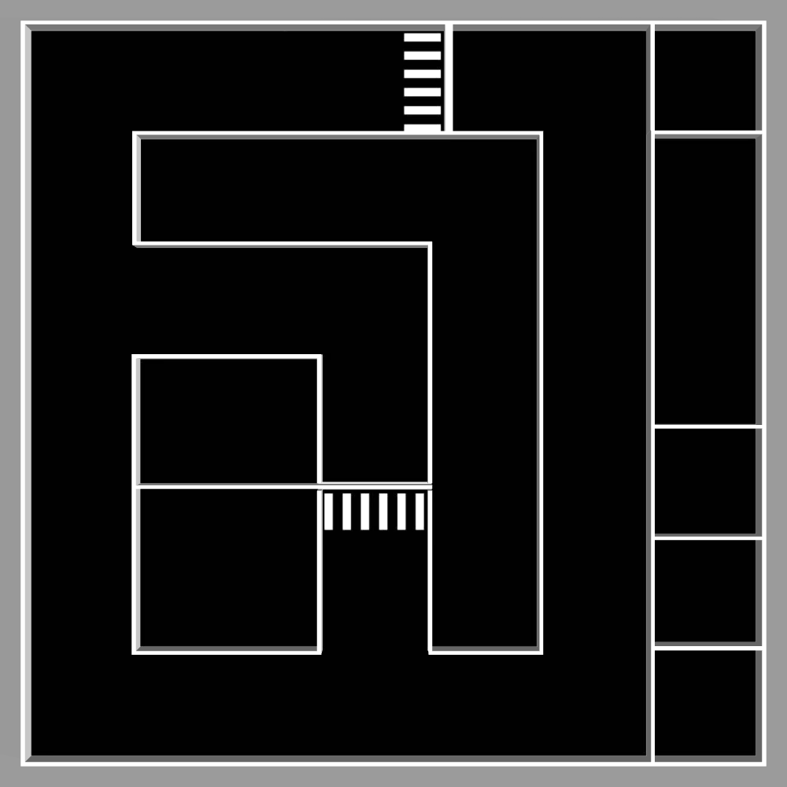

# 4.2 m × 4.2 m 比赛场地 · Gazebo 仿真

由一张俯视平面图自动生成的 ROS Noetic + Gazebo 11 比赛场地仿真。
地面贴图就是原始地图图片本身，墙体是从图中白色线条**挤出**的三维几何。



---

> **换机器跑 / 第一次跑，先看 [`docs/wsl_setup.md`](docs/wsl_setup.md)**
> （依赖清单、clone 后怎么编、哪些东西没入库、WSL 注意事项）。
> **场景已搭建完成，要看交接请看 [`交接文档.md`](交接文档.md)**（现状 / 还差什么 / 场地外扩注意事项 / 踩过的坑）。
> 要验收看 [`验收指南.md`](验收指南.md)：三条命令启动，或
> `./tools/acceptance.sh` 一键跑 6 项自动检查。

## 1. 场地是怎么从图片里提取出来的

原始图片 `1280×1280`，纯黑（可通行）/ 纯白（墙）二值图。

| 项目 | 数值 |
|---|---|
| 场地外框在图中范围 | x `[29, 1252)`、y `[31, 1254)` = **1223 × 1223 px** |
| 比例尺 | **3.434 mm / px** |
| 场地尺寸 | **4.200 × 4.200 m**（**外沿**到外沿） |
| 墙体厚度 | 中位 **24 mm**（6~7 px），其中一处加厚墙为 **45 mm** |
| 提取出的墙体 | **32 段**轴对齐矩形，总长 41.4 m |
| 条纹区域 | 2 处，各 6 条 |
| 矢量化还原精度 | 与原图掩膜 **IoU = 0.968**（残差全部来自 JPEG 抗锯齿边缘） |

坐标系：**场地中心为原点**，`+x` 向右、`+y` 向上（俯视），`z = 0` 为地面。
即俯视时图片的"上"对应 `+y`、"右"对应 `+x`——和 RViz 的 `TopDownOrtho` 视图一致。

> 图片最外圈那 2 px 白线是**图片边框**（贴着图像边缘、等比缩放的图框），不是墙，已忽略。

### 一个被踩过的坑（已修复并验证）

Gazebo 对 box 顶面的 UV 映射是：贴图 `+u` → 世界 `-y`，贴图 `+v` → 世界 `-x`；
而墙体是按"图片 `+x` → 世界 `+x`"布置的。两者天然差 90°。
所以生成脚本会把地面贴图**逆时针预旋转 90°** 后再写出。

这一点不是靠推理，而是靠**离屏渲染实测**校准的：分别只渲染地面、只渲染墙体，
再各自与原图做 8 种朝向的匹配。修正前后：

| | 修正前 | 修正后 |
|---|---|---|
| 地面贴图最佳朝向 | `identity`（F1 = 1.000） | `rot270`（F1 = **1.000**） |
| 墙体几何最佳朝向 | `rot270`（F1 = 0.932） | `rot270`（F1 = **0.932**） |

两者现在一致，说明**贴图线条与三维墙体完全重合**（预览图里灰色墙体正好压在白线上）。

---

## 2. 目录结构

```
人工智能算法大赛/
├── README.md                        ← 本文件
├── src/
│   ├── competition_arena/           ← 场地功能包
│   │   ├── package.xml  CMakeLists.txt
│   │   ├── worlds/competition_arena.world      ← 【核心】Gazebo 世界（地面+墙体）
│   │   ├── media/materials/
│   │   │   ├── textures/arena_floor.png        ← 地面贴图（已预旋转 90°）
│   │   │   │            arena_floor_unrotated_reference.png  ← 未旋转版，仅供人眼对照
│   │   │   └── scripts/arena.material          ← OGRE 材质脚本
│   │   ├── maps/arena_map.pgm / .yaml          ← ROS 栅格地图（导航用，黑=障碍）
│   │   ├── launch/arena_only.launch            ← 只启动场地（看地图用）
│   │   ├── rviz/arena.rviz
│   │   ├── scripts/build_arena.py              ← 【核心】从图片重新生成整个场地
│   │   ├── tools/map_source.jpg                ← 输入图片
│   │   ├── tools/arena_geometry.json           ← 提取出的几何数据
│   │   └── docs/arena_preview.png              ← 预览图
│   └── competition_robot/           ← 机器人功能包 (四轮麦克纳姆)
│       ├── config/robot_params.yaml        ★ 唯一真值源
│       ├── scripts/mecanum.py              正/逆运动学 (仿真+真机共用)
│       ├── scripts/mecanum_odometry.py     轮式里程计  (仿真+真机共用)
│       ├── scripts/sim_wheel_encoders.py   理想编码器  (仅仿真)
│       ├── scripts/gen_robot.py            YAML -> URDF
│       ├── urdf/competition_robot.urdf     生成物
│       ├── launch/robot_gazebo.launch
│       └── docs/参数测量清单.md            ★ 拿实车量尺寸看这个
├── tools/                           ← 开发/校验脚手架（非运行必需）
│   ├── verify_alignment.sh          ← 一键校验"贴图 vs 墙体"是否对齐
│   ├── render_topdown.sh            ← 离屏俯视渲染
│   ├── capture_topdown.py
│   └── test_launch.sh               ← 无头端到端自检
├── build/  devel/                   ← catkin 编译产物（已编译好）
```

---

## 3. 编译与运行

```bash
cd ~/桌面/人工智能算法大赛
source /opt/ros/noetic/setup.bash
catkin_make                       # 已编译过，改过文件才需要重跑
source devel/setup.bash

# 一键启动：场地 + 机器人 + RViz  (机器人见第 9 节)
roslaunch competition_robot robot_gazebo.launch

# 只看场地（不启动机器人）
roslaunch competition_arena arena_only.launch
```

常用参数：

```bash
roslaunch competition_arena arena.launch gui:=false          # 无 Gazebo 界面
roslaunch competition_arena arena.launch rviz:=false         # 无 RViz
roslaunch competition_arena arena.launch x:=-0.48 y:=-1.77 yaw:=0.0   # 自定义初始位姿
```

机器人默认出生在**场地南侧走廊**中心 `(-0.483, -1.774)`，朝 `+x`。

### 键盘控制

```bash
rosrun teleop_twist_keyboard teleop_twist_keyboard.py    # 需 apt install ros-noetic-teleop-twist-keyboard
# 或者手动发速度
rostopic pub -r 10 /cmd_vel geometry_msgs/Twist "{linear: {x: 0.3}, angular: {z: 0.0}}"
```

---

## 4. 话题 / TF

| 话题 | 类型 | 频率 | 说明 |
|---|---|---|---|
| `/cmd_vel` | `geometry_msgs/Twist` | — | 速度指令 |
| `/odom` | `nav_msgs/Odometry` | 50 Hz | 轮式里程计（`encoder` 模式，会漂移） |
| `/scan` | `sensor_msgs/LaserScan` | 15 Hz | 360° 2D 激光，0.10–8.0 m，720 点 |
| `/camera/rgb/image_raw` | `sensor_msgs/Image` | 15 Hz | 1280×960 RGB（2026-09-21 从 640×480 提到 1280×960，为车牌 OCR） |
| `/imu` | `sensor_msgs/Imu` | 100 Hz | |
| `/joint_states` | `sensor_msgs/JointState` | 30 Hz | 左右轮 |

TF 树：`odom → base_footprint → base_link → {left/right_wheel_link, front/rear_caster_link, laser_link, camera_link, imu_link}`

机器人参数：车体 0.26×0.22×0.09 m、驱动轮 r=45 mm、轮距 0.24 m、底盘离地 20 mm、总重约 2.2 kg。
（底盘离地间隙是必须的——车体底面贴地会拖地导致差速底盘根本走不动。）

---

## 5. 换地图 / 改参数

所有产物都由 `scripts/build_arena.py` 一张图生成，改完重跑即可：

```bash
python3 src/competition_arena/scripts/build_arena.py --help

# 常用
python3 src/competition_arena/scripts/build_arena.py \
    --arena 4.2 \            # 场地外沿尺寸 (m)
    --wall-height 0.5 \      # 墙高 (m)，默认 0.5
    --stripes flat \         # 条纹：flat=只做贴图；raised=做成低矮凸起
    --map-resolution 0.01    # ROS 栅格地图分辨率 (m/cell)
```

换新地图：把新图片覆盖 `src/competition_arena/tools/map_source.jpg`，
必要时改脚本顶部的 `ARENA_PX`（场地外框在图片中的像素范围），然后重跑。
脚本会自动重新算出比例尺、墙体、贴图与栅格地图。

重新校验贴图是否与墙体对齐：

```bash
bash tools/verify_alignment.sh
# 期望输出:  >>> ALIGNED   (floor: rot270 @ 1.000, walls: rot270 @ 0.932)
```

它会分别"只渲染地面"和"只渲染墙体"，各自与原图做 8 种朝向匹配；
两边选中的朝向一致，就说明贴图和墙体严格重合。

---

## 6. 关于图中的两处条纹区域

图中有两处"6 条平行线"的区域（顶部中间一处横条、中部一处竖条），
尺寸都是 **0.21 × 0.57 m**，恰好互成 90°。
在建筑制图里这种平行线通常表示**台阶 / 坡道 / 减速带**一类的构造。

目前**默认按"地面图案"处理**——只在贴图上显示，不生成三维几何，机器人可以直接压过去。
如果实际比赛里它们是必须翻越的障碍，一行命令改成凸起：

```bash
python3 src/competition_arena/scripts/build_arena.py --stripes raised --stripe-height 0.03
```

---

## 7. 需要你确认的几点

1. **4.2 m 是外沿还是内净空？** 现在按"外沿到外沿 = 4.2 m"处理（内净空 ≈ 4.152 m）。
   若官方口径是内净空 4.2 m，用 `--arena 4.248` 重新生成即可。
2. ~~**墙高 0.5 m** 是猜的~~ → **已定：0.30 m，且围墙退到白线外 0.10 m**（2026-09-21）。
   原因：官方红绿灯是横排 64 cm 宽、两脚间距 59 cm 的落地灯，白线内"车道边缘 →
   白线"只剩 13.6 cm，双支架摆不进去。所以按"**白线内仍是 4.2×4.2 可行驶，围墙退到
   图片外圈**"处理（`build_arena.py --margin 0.10`，地板 4.4×4.4，围墙内沿 ±2.176）。
   墙高 0.30 m：灯箱在 0.34~0.48 m，墙若 0.5 m 会挡住最外侧那颗透镜。
   地图已同步重出（否则 AMCL 会有 10 cm 系统性偏差）。
   见 [`src/competition_arena/docs/traffic_light_model.md`](src/competition_arena/docs/traffic_light_model.md)。

3. **条纹区域**的含义（见第 6 节）。
4. **机器人平台**：本机没有装 TurtleBot3，所以配了一个通用差速底盘做测试。
   如果比赛指定平台（TurtleBot3 / 自制车），把尺寸告诉我，我按真车参数改 `urdf/`。

---

## 8. 已验证项

在无头模式下实测通过：

- `catkin_make` 编译通过
- 场地 + 机器人正常加载，`gzserver` 无报错
- 地面贴图与三维墙体逐像素对齐（F1 = 1.000 / 0.932）
- `/scan` 14.9 Hz、`/odom` 50 Hz、`/imu` 100 Hz、相机出图
- 发 `/cmd_vel` 后机器人实际前进 1.26 m，里程计与 TF 正常
- ROS 栅格地图 436×436 @ 0.01 m/cell，黑=障碍白=可通行，方向与场地一致

> 注：本机沙箱里 `$HOME` 只读、且无 GPU，测试时用了
> `HOME=<工作区>/.sim_home` 和 `LIBGL_ALWAYS_SOFTWARE=1`。
> 你自己机器上正常跑**不需要**设这两个变量。

---

## 9. 机器人：四轮麦克纳姆（sim2ros）

### 参数只有一份

```
        config/robot_params.yaml   ← 唯一真值源
                 │
     ┌───────────┴───────────┐
     ▼                       ▼
gen_robot.py            真机驱动节点
     │                  (读同一份 YAML)
     ▼                       │
competition_robot.urdf       │
     │                       │
     ▼                       ▼
Gazebo 仿真 ── /cmd_vel ──→ 真实小车
            ←── /odom ─────
```

几何、运动学、topic 名、frame 名全部来自同一份参数，
所以仿真里调好的定位/导航参数搬到真车不用改。

### 运行

```bash
roslaunch competition_robot robot_gazebo.launch
```

### 话题

| 话题 | 说明 |
|---|---|
| `/cmd_vel` | **全向**：`linear.x` 前后、`linear.y` 横移、`angular.z` 自转 |
| `/odom` | 轮式里程计，仿真/真机同源（`mecanum_odometry.py`） |
| `/odom_groundtruth` | Gazebo 真值，**仅仿真**，用来对比定位误差 |
| `/joint_states` | 四个轮子转角（仿真里是理想编码器） |
| `/points` | 16 线 3D 激光雷达点云（**默认关**，见下面"建图默认用 2D 雷达"） |
| `/scan` | **2D 雷达直接发的** `LaserScan`（720 点/圈，0.1~6 m），给建图/AMCL 用 |
| `/camera/rgb/image_raw` | RGB 相机（只发 RGB） |
| `/imu` | IMU |

TF：`odom → base_footprint → base_link → {4个轮子, laser_link, camera_link, imu_link}`

### 建图默认用 2D 雷达（实车同款）

实车装的是 **镭神 N10_P 2D 雷达**，所以仿真里 `/scan` 也由 2D 雷达
（`gazebo_ros_laser`）直接发，不绕 3D 点云。
原因：3D 那套用的 `gazebo_ros_block_laser` 插件**贴墙/在角落时会给出不可能的
回波**（车头 0.06 m 贴墙却报 3.8~11.5 m 的点），gmapping 会把它们当墙，
在地图外面糊出一大片扇形（已复现+量化）。换成 2D 雷达后，同样的"死顶墙"测试里
每一束都和已知几何吻合到 2 cm 内，贴得比 `range_min` 还近的方向老实报 `inf`。

```bash
# 建图 (gmapping, 参数已按实测调过)
roslaunch competition_robot slam_gmapping.launch
# 另一种: 图优化 SLAM, 带回环 (已装好, 可直接对比)
roslaunch competition_robot slam_karto.launch
# 存图
rosrun map_server map_saver -f ~/桌面/人工智能算法大赛/maps/my_map
```

### 航点巡航（图上标点 → 自动跑）

```bash
python3 tools/detect_marks.py 标注图.jpeg --out src/competition_robot/config/waypoints.yaml
python3 tools/patrol.py --dry-run          # 校对点位
python3 tools/patrol.py                    # 先 cmd_vel 原地转向, 再 DWA 直着过去
```
标点用 `src/competition_arena/docs/coord_world_grid.png`（每 0.5 m 一格，绿框内车停得下）。
实测 8 个航点 + 回起点 **8/8 到达**，到点误差 ~7 cm。

### 定位 + 导航（AMCL + move_base）

```bash
roslaunch competition_robot navigation.launch          # 仿真 + 地图 + AMCL + move_base + RViz
```

> **新开终端报 `RLException: ... is neither a launch file in package`？**
> 那是因为 `devel/setup.bash` 没 source（`~/.bashrc` 里通常只有 `/opt/ros/noetic/setup.bash`，
> 不含本工作区）。两个办法：
>
> ```bash
> # 办法一: 每次手动 source
> cd ~/桌面/人工智能算法大赛 && source devel/setup.bash
>
> # 办法二(推荐): 用包装脚本, 自动 source + 自动检查残留进程 + 自动避开 .venv
> tools/nav.sh
> tools/nav.sh planner:=teb
> tools/nav.sh sim:=false          # 仿真已经在跑
> tools/nav.sh --build              # 先 catkin_make 再启动
> ```
>
> 想一劳永逸，把下面这行加到 `~/.bashrc` 末尾（注意判断存在，否则新克隆的仓库会报错）：
> ```bash
> [ -f ~/桌面/人工智能算法大赛/devel/setup.bash ] && source ~/桌面/人工智能算法大赛/devel/setup.bash
> ```

RViz 里 `2D Pose Estimate` 定一下车的位置 → `2D Nav Goal` 点目标点，车自己开过去。
不开 RViz 也行：

```bash
python3 tools/go_to.py 0 0            # 去场地中心
python3 tools/go_to.py -1.5 -1.5 1.57
```

参数在 `src/competition_robot/config/nav/`（AMCL 用 **omni 模型**，局部规划
`TrajectoryPlannerROS` 开了 `holonomic_robot`，麦轮可以横移）。
实测：场地内连续 6 个目标点 **6/6 到达、0 次恢复行为**，AMCL 定位误差中位 **5.1 cm**。
注意**目标点离墙留 0.4 m 以上**（场地小，膨胀给大了靠墙的点会到不了）。

**想要"走得直、转弯丝滑"**：本机原来只有最老的 `TrajectoryPlannerROS`（会蛇形、
到点前原地转圈），我已经把它的配置改好了；想更进一步就装 TEB：

**三个规划器都装好并实测过了**（`bash tools/bench_nav.sh <planner>` 可复现）：

| 规划器 | 直线横向偏差 | 贴墙转弯目标 | 中场转弯目标 |
|---|---|---|---|
| **dwa（默认）** | 5 mm | ✓ 13.9 s | — |
| teb | 54 mm | ✗ 会摆头 | ✓ 9.2 s（最丝滑，无原地转） |
| traj | 3 mm | ✓ 19.0 s | — |

导航默认用**几何生成的干净地图**（`tools/gen_map_from_arena.py` 生成，
边界准确、墙不厚、坐标系=世界系），比 SLAM 图可走面积多 0.4 m²、直线横向偏差更小：

```bash
python3 tools/gen_map_from_arena.py            # 重新生成
roslaunch competition_robot navigation.launch                  # 默认 DWA + 干净地图, 哪儿都能到
roslaunch competition_robot navigation.launch planner:=teb     # 目标在中间时更丝滑
bash tools/bench_nav.sh teb                                    # 自己复现对比
```

> TEB 的坑：`max_vel_y>0` 会用横移抄近路（看着很怪），`weight_kinematics_nh` 给太大会摆头。
> 配置里都已经改好（`max_vel_y: 0` + 小权重）。
详见 [`src/competition_robot/README.md`](src/competition_robot/README.md) 第 4.5 节。

**横向对比不同建图算法**（同一个不撞墙的小方框路径 + 自动打分）：

```bash
bash tools/bench_slam.sh gmapping      # -> maps/bench_gmapping.pgm + 自动打分
bash tools/bench_slam.sh karto
python3 tools/check_map_quality.py maps/bench_gmapping.pgm
python3 tools/check_scan_selfhit.py    # 检查 /scan 有没有打到自己车体的假回波
```

其他可选建图方案（本机目前只装了 gmapping / karto / amcl，其余要 `apt install`）：

| 方案 | 包 | 特点 |
|---|---|---|
| **gmapping** ✅已装 | `ros-noetic-gmapping` | 粒子滤波, 要里程计, 无回环; 小场地够用 |
| **slam_karto** ✅已装 | `ros-noetic-slam-karto` | 图优化 + 回环, 场地大/绕圈多时更稳 |
| hector_slam | `ros-noetic-hector-slam` | **不需要里程计**, 纯扫描匹配; 对雷达频率/转速敏感 |
| cartographer | `ros-noetic-cartographer-ros` | 2D/3D 子图 + 回环, 最稳但最重, 要里程计+IMU |
| rtabmap | `ros-noetic-rtabmap-ros` | 图优化, 可用 RGB-D 做视觉回环, 也能出 3D 图 |
| LIO-SAM / FAST-LIO 等 | 源码编译 | 激光-惯性 3D SLAM, 用 3D 雷达+IMU; 本场地属于杀鸡用牛刀 |
| octomap_server | `ros-noetic-octomap-server` | 不是 SLAM, 是把点云转成 3D 占据栅格 |

**自研全向驱动插件**：`gazebo_ros_planar_move` 的实际自转只有指令的约 0.72 倍
（根因是它的 `SetAngularVel` 会把四个车轮的角速度一起锁死）。
本包自带 `src/holonomic_drive_plugin.cpp` 替代它，实测自转保真度 **0.994**。
详见 [`src/competition_robot/README.md`](src/competition_robot/README.md) 第 4.3 节。

改参数后重新生成：

```bash
cd src/competition_robot && python3 scripts/gen_robot.py
```

详细说明和**已知设计取舍**见 [`src/competition_robot/README.md`](src/competition_robot/README.md)；
拿实车量尺寸看 [`docs/参数测量清单.md`](src/competition_robot/docs/参数测量清单.md)。

---

## 10. 视觉环境（复赛「视觉识别与检测」15 分）

仿真和导航跑在系统 Python 上；**深度学习 / 视觉栈单独放在仓库根的 `.venv/`**
（已 gitignore）。之所以不用系统 Python：本机没有 pip、没有可用 sudo、`$HOME` 只读。

### 一条命令重建

```bash
tools/setup_vision_env.sh              # 本机（无显卡，装 CPU 版 torch）
tools/setup_vision_env.sh --cuda 121   # 显卡机（CUDA 版本按实际填）
tools/setup_vision_env.sh --recreate   # 清空重来
```

实测版本：torch `2.4.1+cpu` / torchvision `0.19.1` / ultralytics `8.4.155` /
opencv-python `4.10.0` / numpy `1.24.4` / hyperlpr3 `0.1.3` / onnxruntime `1.19.2`

> 详细说明、踩过的坑、搬显卡机的注意事项见 [`docs/vision_env.md`](docs/vision_env.md)。
> 复赛要求拆解与差距分析见 [`复赛要求与差距分析.md`](复赛要求与差距分析.md)。

### 车牌字符识别（已验证可用）

```bash
.venv/bin/python tools/plate_ocr.py --selftest     # 生成合成蓝牌并自检, 期望 3/3
.venv/bin/python tools/plate_ocr.py 车牌裁剪图.png  # 识别单张
```

实测结论：HyperLPR3 自带的检测器**需要场景上下文**（纯车牌特写会漏检），
但**识别网络对紧裁剪的车牌完美工作**（自检 3/3，置信度 0.993–0.997）。
所以 `tools/plate_ocr.py` 只加载识别网络，正好配合
「YOLO 框车牌 → 裁剪 → OCR」的流程。

分辨率下界也测过：把官方车牌重采样到 **70 px 宽**（每字形 8.75 px）再喂识别网络，
仍然 **3/3 全对**（含 1.2 px 模糊）。所以车牌任务的瓶颈在"把车牌框出来"，不在识别。

### 识别点位与拍照距离（可直接复算）

```bash
python3 tools/gen_recognition_points.py        # 约 5 秒, 不需要起仿真
.venv/bin/python tools/check_ocr_resolution.py # 车牌 OCR 分辨率下界
```

它把"车该停在哪个点、朝哪、目标占多少像素"从真值源**算出来**（不手填）：
道具位姿来自 world、尺寸来自各 config、相机模型来自 `robot_params.yaml`、
车道线/停止线从官方平面图程序提取（`config/lane_lines.json`）。
产出 `config/recognition_points.yaml` + `docs/recognition_points.md` +
俯视核对图 `docs/recognition_points.png`。

复算结果（2026-09-21）：红绿灯停在**停止线内侧 0.10~0.16 m**、灯珠 **101 px**；
车牌在"不压车道线"前提下最近 0.70 m、**157 px 宽**；
两个街区的人偶**每个方向一个"正对"点位**（相机光轴垂直于立牌板面，正视度 1.00），
画面里立牌宽 123~205 px —— 但相机只有 0.20 m 高且无俯仰，正对时下沿必然被切，
可见高度约 60%~75%。

### 最终巡检路线（航点 + 沿途识别点）

```bash
python3 tools/gen_recognition_route.py     # 把识别点按弧长插进巡检环线 -> 17 站
./tools/run_recognition_route.sh           # 一键: 起仿真 -> 跑整条 -> 存轨迹 -> 重画图
```

路线 = 原来那条巡检环线 + 沿途 10 个识别点（10 个点离环线都只有 0.01~0.12 m），
共 17 站。每个识别点的动作就是"**原地转向 → 直线过去 → 到点原地转到拍照朝向**"，
正是比赛要求的"开到固定点位原地转向拍照"。实测（无头仿真）**17/17 到点、0 失败**，
AMCL 到点误差均值 0.056 m、原地转向残余 ≤1.0°、一圈 166 s。
路线图 `docs/recognition_route.png`（红=实测轨迹，橙=规划环线，数字=顺序）。

### 换到显卡机

```bash
git clone git@github.com:Gh0stown/AiC-2026.git && cd AiC-2026
tools/setup_vision_env.sh --cuda 121
```

`.venv/`、`.cache/`、`datasets/`、`runs/`、`*.pt`、`*.onnx` **都不入库**（体积大），
脚本会自动重建或重新下载，**不需要手工拷贝**。
若显卡机是 Python 3.10+，可以放开 torch 版本上限：`TORCH_VER=2.5.1 tools/setup_vision_env.sh --cuda 121`
