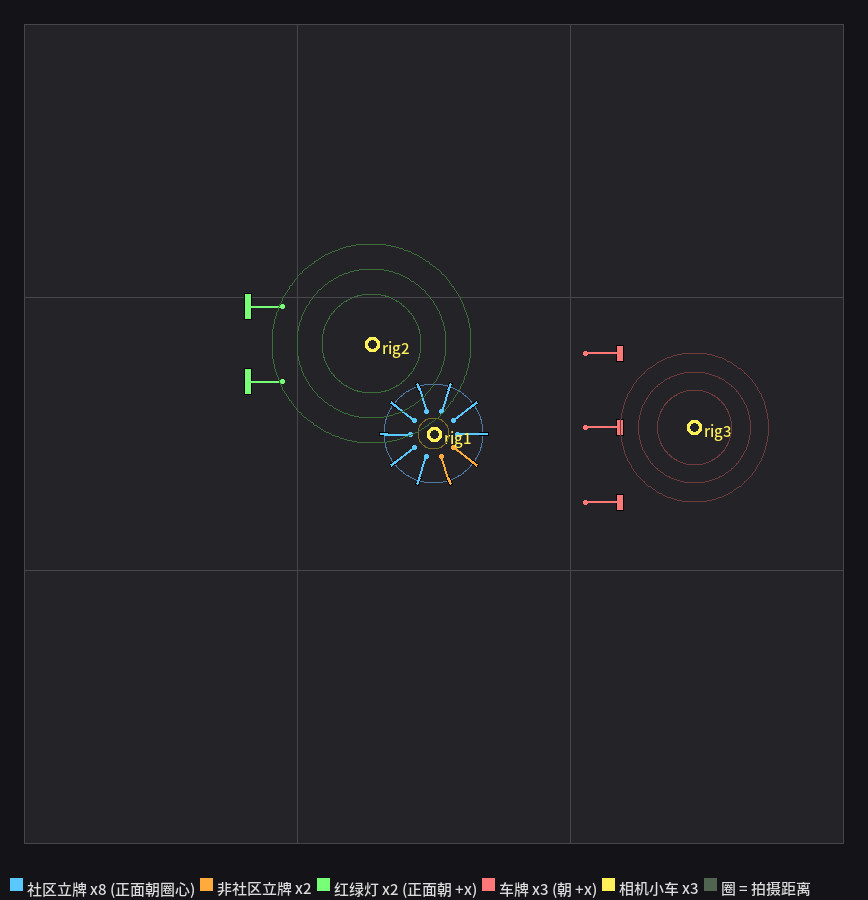

# 采集专用世界（三工位 + 三台相机小车并行）

> 2026-09-23。**不在比赛场地上拍**，而是新建一个只放"小车 + 要识别的东西"的世界。
> 生成器：`tools/build_collect_world.py`　采集器：`tools/gen_collect_dataset.py`
> 俯视图：`docs/collect_layout.png`

## 为什么不在比赛场地上拍

比赛场地里立牌是**贴着街区边线**摆的、车只能在车道上跑，所以**绕不到目标侧面**，
换个角度就只能拍到背面。采集需要多角度 → 专门建一个世界，没有围墙/街区，车可以随便传送。

## 三个工位



| 工位 | 布置 | 怎么拍 |
|---|---|---|
| **A 立牌圈** | 10 个立牌（社区 c01–c08 + 非社区 F1/F2）围成圈，**每个立牌的 yaw = 它的方位角** → 正面**全部朝圈心** | 小车在**圈心附近**（偏移 ≤0.15 m）逐个立牌正对着拍 —— 所以**永远是正面**；一帧还会带上左右邻居（对检测是好事）|
| **B 红绿灯** | 2 个灯（名字仍叫 `tl_top`/`tl_bot`，切换节点照常认）正面朝 +x 摆一排 | 小车在灯正前方 0.8/1.2/1.6 m，**红黄绿三种状态各拍**（状态是**强制**的，不用等它自己循环）|
| **C 车牌** | 3 辆车车牌朝 +x 摆一排 | 小车在车牌正前方 0.6/0.9/1.2 m 正对着拍 |

场地铺 **3×3 的场地贴图**（13.2×13.2 m），保持和比赛场地**同样的观感**（黑底 + 白线），
减少训练/部署的域差。

## 三台相机小车并行（3× 速度）

**能**，但有个拦路石：相机插件的话题名是**写死**的（`/camera/rgb/image_raw`），
三个实例会撞同一个话题 ✗。

所以不用"三个完整机器人"（那要改 URDF/控制器/里程计，风险大），而是做**三台"相机小车"（rig）**：

* 相机参数与真车**完全一致**：1280×960 / HFOV 58° / 离地 0.19998 m / clip 0.05~20 / 距车心 0.149 m；
* 每台**各自独立一个模型文件**，配自己的 `robotNamespace` → 话题互不干扰：
  `/rig1/camera/rgb/image_raw`、`/rig2/...`、`/rig3/...`
* **动态但关重力**：传送后不会掉，而且**渲染会跟随**（静态模型用 SetModelState 挪了不重绘）；
* 采集流程本来就只"传送"不"驱动"，所以不需要驱动插件/里程计 —— 位姿直接从
  `/gazebo/get_model_state` 读。

三台分工正好对应三个工位，互不干扰：

```bash
# ① 建世界（只需一次）
python3 tools/build_collect_world.py
# ② 起这个世界的仿真
roslaunch competition_robot robot_gazebo.launch \
    world:=$(rospack find competition_arena)/worlds/collect.world gui:=false

# ③ 三个终端并行（各自一台 rig + 一个工位）
python3 tools/gen_collect_dataset.py --rig 1 --only-phase ring  --out datasets/collect_ring
python3 tools/gen_collect_dataset.py --rig 2 --only-phase light --out datasets/collect_light
python3 tools/gen_collect_dataset.py --rig 3 --only-phase plate --out datasets/collect_plate
```

> 三台相机同时渲染会**三倍渲染开销**。比赛相机大约只占仿真负载的 10%（issue #5 测过），
> 所以有 GPU 的机器问题不大；本沙箱是软件渲染，跑不动三台。

**不加 `--rig`** 就用完整机器人 `competition_robot`（单机串行），三个工位一次跑完：

```bash
python3 tools/gen_collect_dataset.py --out datasets/collect          # 107 张
python3 tools/gen_collect_dataset.py --dry-run                      # 先看规划 + 命中率
```

## 量级与参数

默认（每立牌 8 视角、灯 3 态 × 3 距离、车牌 3 距离）：

| 工位 | 张数 | 距离（相机到目标）|
|---|---|---|
| 立牌 | 10 × 8 = **80** | 0.50 ~ 0.80 m（比赛里是 0.50~0.55 ✓）|
| 红绿灯 | 2 × 3 态 × 3 = **18** | 0.80 ~ 1.60 m |
| 车牌 | 3 × 3 = **9** | 0.60 ~ 1.20 m |
| 合计 | **107** | 想加量：`--ring-views 16 --per 2` |

## 两个必须知道的坑

1. **"拍摄距离"不等于圈半径** —— 相机在车心**前方 0.149 m**，所以
   `相机到立牌 = 半径 − 圆心偏移 − 0.149`。R=0.6 时实际只有 0.30~0.40 m，
   立牌下沿直接被切出画面（可见角点 50% < 60% 门槛）✗。
   现在有 `--min-shot-dist 0.48` 守卫（相机高 0.2 m 水平看，全身需要 d≥0.48），
   `--dry-run` 会打印**目标在画面里的比例**，默认已经做到 **107/107 = 100%** ✓。
2. **只出图，不写框** —— 投影出来的框有系统性偏差（issue #10），
   手工用 X-AnyLabeling 标更可靠。`meta.jsonl` 仍然记 **灯态** 与 **车牌字符串**
   （手工标注标不出来，评估要用），以及每个目标的 `seen`（投影粗判，用于核覆盖率）。
