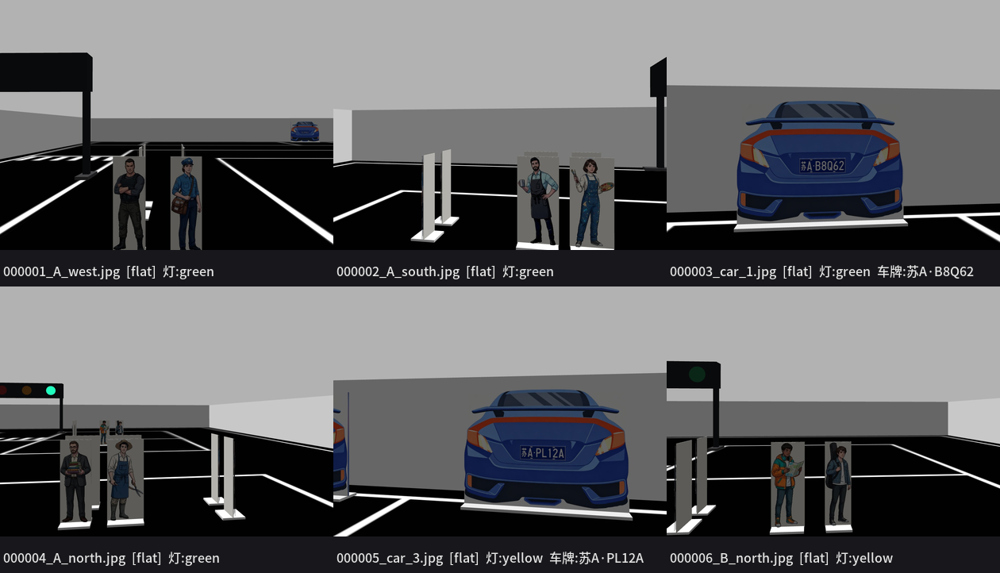
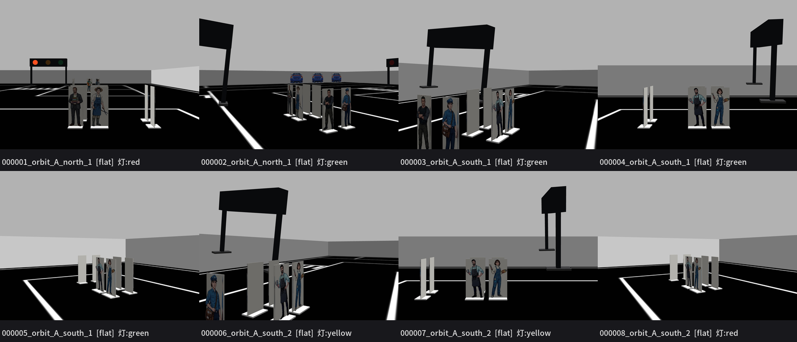

# 视觉方案思路（复赛：红绿灯 / 人偶立牌 / 车牌）

> 写于 2026-09-22。复赛提交截止 **10-10**，这是一份"怎么选型、按什么顺序做、怎么验收"的讨论稿。
> 结论先放前面：**三个任务先用经典 OpenCV 打通闭环（约 2~3 天），再用 YOLO 升级（可选）**。

---

## 0. 为什么现在做视觉是"快活"

前置工作已经全部做完了，视觉任务最难的部分（**在哪儿拍、拍多大**）已经不缺：

| 已有资产 | 位置 | 说明 |
|---|---|---|
| **识别点位 + 朝向** | `config/recognition_points.yaml` | 10 个点位，**正对**目标（正视度 1.00），车到点原地转向即拍 |
| 像素预算 | `docs/recognition_points.md` | 灯珠 101 px / 车牌 157 px / 立牌 97~176 px 宽、91~100% 可见 |
| **实拍数据集生成器** | `run_recognition_route.sh --capture` | 每次一个文件夹，10 个点各 3 帧 |
| **真值（关键）** | `captures/<run>/index.csv` | 每张图对应的**车牌字符串 / 人偶数 / 拍照瞬间的红绿灯状态** |
| OCR 链路 | `tools/plate_ocr.py` | HyperLPR3 识别网络已验证：紧裁剪 3/3，**70 px 仍全对** |
| 合成数据能力 | Gazebo | 每个物体位姿已知 → **可自动标注**，不用手工标 |

> 也就是说：**"数据集 + 真值 + 点位"三件套齐了**，识别器只要在固定点位上把已知大小的目标认出来。
> 这也意味着**验收可以自动化**（见 §4）。

---

## 1. 红绿灯状态识别

**输入**：停在停止线前（距灯 1.0 m）正对灯箱的图 → 灯珠 **101 px**，整个灯箱 ~740 px。

| 方案 | 做法 | 优点 | 风险 |
|---|---|---|---|
| **A1 经典（先做）** | ① 定位灯箱（暗色矩形 + 3 个近共线圆）② 三颗灯珠取 HSV ③ 最亮/最饱和的那颗判色 | 半天出结果；101 px 下颜色分类极其稳；无需 GPU | 场景里有红色/橙色/绿色的干扰（**人偶衣服！**）→ **必须限定在灯箱 ROI 内**，不能全图数颜色 |
| A2 YOLO | 检测灯箱 + 分类三态；Gazebo 自动标注合成数据 | 对光照/角度鲁棒；官方技术栈叙事好 | 1~2 天 |

**现有雏形**：`tools/check_traffic_light.py` 已经在"数全图颜色像素"（>40 且比第二名多 3 倍）。
→ A1 要做的是把它升级成"**先找灯箱、再判灯珠**"，并把结果发成话题。

**输出**：`/vision/traffic_light`（`std_msgs/String`: `red|yellow|green|none`）
**交叉验证**：开发期可以拿 `/traffic_light/state` 当真值（但**最终演示不能用**——复赛要求"调用视觉算法"）。

---

## 2. 人偶立牌检测（+ 人群计数）

**输入**：5 个方向各一张（A 街区北/南/西，B 街区北/东），每张正对 2 个立牌，
宽 97~176 px、高 ~300 px、91~100% 可见。

| 方案 | 做法 | 优点 | 风险 |
|---|---|---|---|
| **B1 模板匹配（先做）** | 18 张官方素材原图当模板，`matchTemplate` 多尺度（±25%）+ NMS | **零训练**；仿真里贴图就是原图，几乎必中；计数=数框 | 只认这 18 个模板；实拍（打印件/光照/透视）需要多尺度+仿射缓解 |
| B2 分割 | 深色地面上做人形轮廓分割（宽高比 ~1:3） | 不依赖模板 | 衣服与背景/车道线接近时漏检；斜视时轮廓变窄 |
| B3 YOLO | Gazebo 合成数据自动标注（还能一次出"社区/非社区"分类） | 鲁棒、可迁移、PPT 亮点（sim2real 合成数据） | 2~3 天 |

**输出**：`/vision/standee`（JSON：数量 + 每个框 + 类别）
**人群计数**：per-edge 的检测数按街区求和（A = 北+南+西，B = 北+东）。

> ⚠️ **一个待确认**：官方示意图上写的是 **A 街区 5 个 / B 街区 5 个**，
> 而我们现在摆的是 **A 6 个（北2+南2+西2）/ B 4 个（北2+东2）**。
> 复赛只考"检测"，但总决赛的"人群数量识别"要看**数量对不对** —— 要不要按 5/5 调整？
> （改 `tools/gen_standees.py` 的 `BLOCKS` 再重跑摆放即可，点位会自动重算。）

---

## 3. 车牌字符识别

**输入**：3 个车位各一张，正对车牌 0.70 m → **157 px 宽**（每字形 ~20 px）。

| 步骤 | 方案 | 说明 |
|---|---|---|
| 定位车牌 | **C1 经典（先做）**：HSV 蓝色分割 + 轮廓 + 长宽比（9.5/3 ≈ 3.17）+ `minAreaRect` → 透视矫正到 200×81 | 仿真里车牌是纯蓝底白字矩形，正对 157 px，分割极稳 |
| 识别字符 | **已有** `tools/plate_ocr.py`（HyperLPR3 识别网络） | 70 px 下界，157 px 有 2 倍余量 ✓ |
| 升级 | C2: YOLO 检测车牌 → 裁剪 → OCR（官方推荐流程） | 解决实拍的倾斜/光照；1 天 |

**输出**：`/vision/plate`（JSON：车牌字符串 + 框 + 置信度）
**注意**：OCR 输出**不含分隔点**（`苏AB8Q62`），与 `cars.yaml` 里的 `苏A·B8Q62` 比对时要归一化。

### ★ 实测：HyperLPR3 的"检测"要背景，"识别"不要（2026-09-22）

用我们的实拍图（`captures/*/16_car_1_f0.png`）做了对照：

| 喂进去的输入 | 整条流水线（检测+识别） | 仅识别网络 |
|---|---|---|
| 整幅场景 1280×960 | ✅ 苏AB8Q62 conf 0.988 | — |
| **紧裁剪**（正好 = 检测框, 123×46） | ❌ **检测不到** | ✅ **0.9998** |
| 留 10 px 背景（143×66） | ✅ 0.9990 | ✅ 0.954 |
| 留 30 px 背景（183×106） | ✅ 0.9786 | — |

**两条结论**：

1. **HyperLPR3 自带的检测器需要上下文的边距** —— 紧裁剪会**直接检测失败**，
   留 10 px 就恢复了（1 m 处车牌宽 157 px，10 px ≈ 6%）。
   所以**不要**把 YOLO 框紧贴着裁下来喂整条流水线。
2. **识别网络对紧裁剪反而更好**（0.9998 vs 留边 0.954），
   `tools/plate_ocr.py` 走的就是这条路（只加载识别网络）。

**因此推荐的流水线**：

```
YOLO 检车牌  ->  裁下来（留一点边距）  ->  plate_ocr.recognize() 识别
                                        （不用 HyperLPR3 的检测器, 也就不需要背景）
```

**顺带一个决策依据**：车牌是三个任务里**最保险**的 ——
就算完全不训练 YOLO，直接用 HyperLPR3 整条流水线喂整幅图，
我们现有实拍已经 **3/3 全对**（0.95~0.9996）。所以
"要不要标车牌框"是**为鲁棒性/叙事加分**，不是保底必需（见 §6 第 4 条）。

---

## 3.5 数据集怎么造（合成数据，零手工标注）

工具：`tools/gen_vision_dataset.py`（生成）+ `tools/preview_dataset.py`（预览/统计）

### 默认：只出图，手工标注（X-AnyLabeling）

> 2026-09-22 决定：自动投影框虽然原理精确，但仍有残差
> （传送位姿残差 + 灯箱受重力下沉约 3 cm，1 m 处≈35 px），
> 而这种**固定场景**手工标 200 张完全够，标注质量更可控。
> 所以生成器**默认只出图**，框变成 `--with-labels` 可选。

```bash
# 主力机：起仿真（只要这个, 不用导航/建图）
roslaunch competition_robot robot_gazebo.launch gui:=false rviz:=false
# 出图（平铺一个文件夹, 文件名带场景, 直接导进 X-AnyLabeling）
python3 tools/gen_vision_dataset.py --n 200 --out datasets/vision_raw
```

产出：`datasets/vision_raw/images/*.jpg`（平铺）+ `meta.jsonl`。

**`meta.jsonl` 一定要留着**：里面的 **灯态**（`light`）和 **车牌字符串**
（`objects[].plate`）是"整图标签"，手工标注很难标 —— 训完模型评估、以及
红绿灯/车牌这两个任务的答案，都要靠它。

手工标注建议的**类别顺序**（与后续训练一致）：

| id | 类名 | 是什么 |
|---|---|---|
| 0 | `standee` | 社区人员立牌 c01~c08 |
| 1 | `non_community` | 非社区人员 F1/F2 |
| 2 | `traffic_light` | 红绿灯灯箱 |
| 3 | `plate` | 车牌 |

在 X-AnyLabeling 里：导入 `images/` → 按上表建 4 类 → 画框 → **导出 YOLO 格式**。

实采样例（issue #8 修复后，`--mode-mix points:1.0`，9/9 帧都含对应场景的目标）：



> 图里能看到：A_west/A_south/A_north/B_north 各自拍到自己的立牌（还顺带带到别组的背面，
> 对训练是好事），car_1/car_3 的车牌清晰可读，`meta.jsonl` 同时记下了
> **灯态**（green/yellow）与**车牌真值**（苏A·B8Q62 / 苏A·PL12A）。

### ⚠️ 投影标注目前**不可信**（issue #10）

`tools/gen_vision_dataset.py` 的自动框是**几何投影**算的，实测和画面**对不上**
（车牌处偏高约 26 px @0.66 m），所以：

* **不要**用 `--with-labels` 的框去训练（会训练出"系统性偏移"的模型，而 mAP 看不出来）；
* 手工标注不受影响 ✓（这也正是当前的选择）；
* 检查/复核用 `tools/check_projection.py`（多距离实测，能区分"相机高度"和"主点"两种根因）；
* 详见 `docs/issue_log.md` 的 #10 与 #10 续。

### 绕圈采集（一次覆盖多角度）

```bash
roslaunch competition_robot robot_gazebo.launch gui:=false rviz:=false
# 立牌 + 车牌各绕 12 个视角; 红绿灯每种状态 4 个视角
python3 tools/gen_vision_dataset.py --mode-mix none \
    --orbit standee,plate --orbit-views 12 --lights-views 4 --out datasets/vision_orbit
```

| 参数 | 说明 |
|---|---|
| `--orbit standee,plate` | 逗号分隔的目标（类名或物体名）；每个物体绕一圈取 N 个视角 |
| `--orbit-views 12` | 每个物体几个视角（在扇区内均匀分布） |
| `--orbit-radius 0.85` | 绕圈半径（m），`--orbit-radius-jitter 0.25` 让尺度有变化 |
| **`--orbit-arc 120`** | **只取正面扇区**（±60°）。★ 立牌是双面的，走满 360° 有半圈拍到**纯色背板** —— 那些帧若标成 `standee`，模型会学成"看到空白色板就报人偶" |
| **`--orbit-min-frac 0.5`** | 目标投影宽度不到"正对时"的一半就不采这个视角（薄板在 ±80° 几乎是边对着相机，没价值）|
| `--lights-views 4` | 红绿灯：每个灯 × **三种状态** × 4 视角；采集时**强制灯态**（`/traffic_light/command`），保证红黄绿均衡，不用等它自己循环 |

用 `set_model_state` **传送**，所以不受可行驶区域限制（能把相机放到街区之间）——
不需要真的把立牌摆成一个圈。

**实测**（8 个立牌 × 3 视角 + 2 灯 × 3 态 × 2 视角 = 36 张）：
存下 35 张、**35/35 都拍到对应目标**，灯态 red/yellow/green 都齐 ✓



> 同一个立牌在不同角度/距离下的样子（文件名带物体名，如 `000003_orbit_A_south_1.jpg`），
> 画面里还能顺带拍到灯箱，`meta.jsonl` 记下了当时的**灯态**。

### 可选：连自动框一起出

```bash
python3 tools/gen_vision_dataset.py --n 200 --out datasets/vision --with-labels --split
```
（`--with-labels` 会写 YOLO txt + `data.yaml`，`--split` 会分 train/val。
自动框可以用来**和手工框对照**，或在赶时间时当预标注。）

### 标注规范（手工标注照这个来）

**核心一条：标注框紧贴物体，不要人为留边。**
留背景是**推理时**的事，由代码按框外扩（HyperLPR3 的检测器需要 ≥10px，见 §3 的实测），
是可调参数；写进标注里模型就会学成"输出偏大的框"，而且以后想改还得重标。

| 类 | 框什么 | 不框什么 |
|---|---|---|
| `plate` | **蓝色车牌矩形**（含白字），长宽比约 3:1（9.5×3 cm）| 保险杠 / 车身 / 车灯 |
| `traffic_light` | **灯箱外壳**（含三颗灯珠的那块黑框）| **立柱/腿** —— 读颜色靠箱内相对位置（15.6%/50%/84.4%），腿会污染框宽 |
| `standee` | **整块立牌，含底部白色底座** | 地面白线 |
| `non_community` | 同上（F1/F2 兜帽人）| — |

通用规则：

* **一张图里所有实例都标**，不要只标最显眼的；
* **被画面边缘截断的也标**（截断框 YOLO 支持）；
* **空帧不画框**（label 文件为空即可）—— 生成的数据里故意留了 ~10% 空帧压误检，
  **不要删**；
* 车牌小到看不清字（< 70 px 宽）时标不标都行，我们的车牌点位是 157 px。

**标完自查**（10 秒，强烈建议）：

```bash
python3 tools/preview_dataset.py <导出的数据集目录> --n 12
```

它把**你自己的**标注画回图上出总览图（读标准 YOLO txt）——
一眼就能看出有没有系统性偏移、有没有漏标。

### 自动标注的原理（仍适用于 --with-labels）

场里每个道具的位姿都有唯一真值源
（`standees.yaml` / `cars.yaml` / `traffic_lights.yaml` + world 里的 include pose），
相机模型也在 `robot_params.yaml` 里 —— 所以把每个物体的 **3D 包围盒投影**到像素就是标注。
几何与相机数学**直接 import `gen_recognition_points.py`**，不维护第二份真值。

**采什么**：三种模式混合

| 模式 | 占比 | 说明 |
|---|---|---|
| `points` | 0.6 | 在 10 个识别点位附近抖动 —— **真实工作包线**。抖动**按拍摄距离缩放**（默认 ±20%，即立牌 ±0.10 m / ±11°），且**目标必须在画面里**（拍不到就重抽）|
| `near` | 0.3 | 在某个物体周围 0.4~2.5 m 随机取位姿、朝向它 —— 提高泛化，**每帧都有目标** |
| `neg` | 0.1 | 空帧 = 负样本（抑制误检），一张都不标 |
| `random` | 0 | 全图随机（大多拍不到目标，仅作背景；默认不用） |

> ★ **issue #8**：抖动以前是全局固定 `0.30 m / 25°`，而立牌点位只距 0.5 m ——
> 25° 横移 0.23 m ≈ 3.5 个立牌宽，**只有 62% 的 points 帧真的拍到目标**
> （A_north 0/3），`scenario` 字段因此误导、按点位评估直接失效。
> 现在改成**比例抖动 + 目标必可见**，实测命中率 **100%**
> （10 个点位各 12/12）；想放大包线用 `--points-jitter 0.4 --points-yaw 0.4`。
> `--dry-run` 会打印**实际达成幅度**（默认位移中位 0.090 m / 朝向中位 4.3°）——
> 抖动现在是"上限"，别拿请求值当包线。

**怎么采**：`/gazebo/set_model_state` 把车**传送**过去，不需要导航/建图，
只要 `roslaunch competition_robot robot_gazebo.launch`。

> ⚠️ 两个必须踩过的坑（已修，写在代码注释里）：
> ① 判"新的一帧"要比较**图自己的 `header.stamp`**，不能用消息到达时间 ——
>    相机出图有延迟，传送后到达的帧可能是传送前渲染的（我曾因此存了一堆错位的图）；
> ② 标注要用 **`/odom_groundtruth` 的真值位姿（含 yaw）**，不要用指令位姿。

### 主力机上的跑法

```bash
# 1. 起仿真（不用 gui/rviz，省性能）
roslaunch competition_robot robot_gazebo.launch gui:=false rviz:=false

# 2. 另开终端：先干跑看统计（几秒，不连仿真）
python3 tools/gen_vision_dataset.py --n 2000 --dry-run

# 3. 真采（1200~2000 张比较合适）
python3 tools/gen_vision_dataset.py --n 2000 --out datasets/vision

# 4. 预览 + 统计（出一张带框的总览图, 用来肉眼验标注）
python3 tools/preview_dataset.py datasets/vision --n 12
```

**产出**：

```
datasets/vision/
  images/{train,val}/*.jpg     1280x960, q92 (约 200~300 KB/张)
  labels/{train,val}/*.txt     YOLO 格式: cls cx cy w h (归一化)
  data.yaml                    直接给 ultralytics 用
  meta.jsonl                   每张图: 位姿/真值位姿/灯态/车牌真值/物体清单/灯珠位置
  preview.png                  preview_dataset.py 生成
```

**规模与耗时**：1200 张 ≈ 300 MB。渲染是瓶颈 —— 本沙箱约 3~10 s/张（要 2~3 小时），
**主力机有 GPU 应该几分钟到十几分钟**，所以这一步交给主力机跑。

**类别**（4 类，一张数据集同时服务三个任务）：

| id | 类名 | 是什么 | 对应任务 |
|---|---|---|---|
| 0 | `standee` | 社区人员立牌 c01~c08（8 个） | 人偶检测/计数 |
| 1 | `non_community` | 非社区人员 F1/F2（2 个） | 总决赛"人员身份" |
| 2 | `traffic_light` | 红绿灯灯箱（2 个） | 红绿灯状态识别 |
| 3 | `plate` | 车牌（3 个） | 车牌识别 |

- **灯态不是框**：它是整张图的标签，记在 `meta.jsonl` 的 `light` 字段
  （采集时订阅 `/traffic_light/state`，循环 绿6s→黄2s→红6s，采久了三种都有）；
- **车牌字符串**记在 `meta.jsonl` 的 `objects[].plate`，给 HyperLPR3 用；
- **灯珠像素位置**也存了（`lamps`），做"箱内三颗按 15.6%/50%/84.4% 采样判色"时可直接校验。

---

## 4. 验收：对着真值自动打分（这是最能加分的一环）

`captures/<run>/index.csv` 里已经有每张图的真值，所以可以写一个
**`tools/check_vision.py <capture_dir>`**：把三个识别器在整份拍摄上跑一遍，输出

```
红绿灯  6/6    (逐点比对 index.csv 的 light_state 列)
人偶    A 北2 南2 西2 / B 北2 东2   计数与 ground_truth 一致
车牌    苏A·B8Q62 ✓  鄂D·7B5Q2 ✓  苏A·PL12A ✓   字符级准确率 100%
```

- 这就是**"识别 vs 真值"的客观数字**，直接进技术方案文档和 PPT；
- 想造数据就多跑几次 `--capture`（灯态/位姿有随机性），**数据集与验收一体**。

---

## 5. 推进顺序（按 10-10 倒排）

| 时间 | 做什么 | 产出 |
|---|---|---|
| 9-23 ~ 9-25 | 三个识别器（OpenCV 版）+ `check_vision.py` | **任务一 15 分闭环**：实拍图上跑出数字 |
| 9-26 ~ 9-28 | 合成数据 + YOLO（人偶优先，车牌次之） | 升级版识别器 + sim2real 故事 |
| 9-29 ~ 10-02 | 技术方案文档 | 任务二（含本文档当骨架） |
| 10-03 ~ 10-06 | PPT + 演示视频录制 | 视频要求：Gazebo+Rviz 同屏、完整建图过程、代码讲解 |
| 10-07 ~ 10-09 | 缓冲 + 提交 | — |

**建议**：先把 9-23~9-25 那段做掉（**保底 15 分**），再决定要不要上 YOLO。
复赛截止前一定要留出"录视频"的时间——那是任务二里最费时、也最容易翻车的环节。

---

## 6. 需要拍板的事

1. **先 OpenCV 还是直接 YOLO？**
   我建议：**先 OpenCV 打通闭环**（半天~1 天/个），再视时间上 YOLO。
   理由：复赛只要"完成核心检测"，OpenCV 在我们的正对点位上完全够；YOLO 是加分与叙事，不是保底。
2. **深度相机要不要开？**（`robot_params.yaml` 的 `publish_depth`）
   官方技术点写了 **RGB-D**，开了能出点云、能报"目标距离"，演示更有料；
   代价是渲染开销（本沙箱 RTF 会掉，主力机有 GPU 应该无感）。**建议开**，但要先测帧率。
3. **实车相机分辨率到底多少？**（一直挂在待确认里）
   我们的像素预算按 1280×960 算。若是 **640×480**，车牌在 0.7 m 只有 ~78 px——
   贴着 OCR 的 70 px 下界，很危险。这条决定要不要把车牌点位再往近处挪。
4. **车牌框要不要标？**（2026-09-22 新增，见 §3 末尾的实测）
   - 不标：车牌任务**今天就能跑通**（HyperLPR3 喂整幅图，实拍 3/3 ✓），
     省下标注时间；缺点是实车鲁棒性全靠 HyperLPR3 的检测器。
   - 标：YOLO 检测 + 透视矫正 + 识别，实车更稳，还能和 HyperLPR3 的框
     **互相校验**（不一致就报警）；而且一个模型统一三个任务，文档/PPT 更完整。
   - 代价很小：场上就 **3 辆车**，只在能看到车的那些帧上标。
