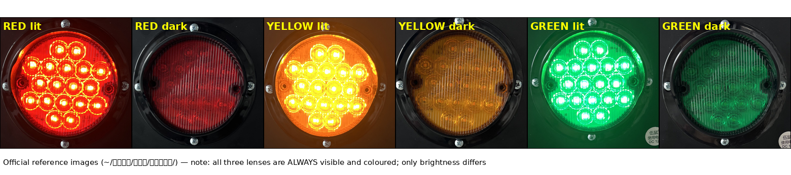

# 红绿灯模型 —— 按官方尺寸制作

> 资料来源：`~/复赛资料/红绿灯/`（官方复赛资料包）
> 制作日期：2026-09-21



## 一、官方尺寸（`尺寸图片.png`）

| 项 | 数值 | 来源 |
|---|---|---|
| 灯箱总宽 | **64 cm** | 图上标注 |
| 灯箱高 | **14 cm** | 图上标注 |
| 灯箱下沿离地 | **34 cm** | 图上标注 |
| 灯箱上沿离地 | **48 cm** | 图上标注 |
| 支架方柱边长 | **2.5 cm** | 图上标注 |
| 灯珠直径 | **8.5 cm** | 图上未标，按「64 cm 横线 = 1079 px」定标量得（143~149 px）|
| 灯珠中心间距 | **22 cm** | 同上（红-黄 373 px、黄-绿 372 px，等距）|

## 二、真实颜色（从官方 6 张状态参考图取样）

`红绿灯图片/` 下是 红/黄/绿 × 亮/暗 共 6 张实拍图。取透镜区中位色得到：

| 状态 | 暗（透镜本色，灭灯） | 亮（点亮） |
|---|---|---|
| 红 | `(0.467, 0.106, 0.122)` | `(0.969, 0.227, 0.086)` |
| 黄 | `(0.588, 0.357, 0.094)` | `(0.988, 0.976, 0.188)` |
| 绿 | `(0.094, 0.376, 0.227)` | `(0.086, 0.941, 0.529)` |
| 灯箱 | `(0.090, 0.102, 0.110)` | — |

> 亮灯时「最亮 8% 像素」已经过曝成近白，不能用来做材质，所以取的是**中位色**。

## 三、★ 一个关键认识：三个透镜始终可见

对比官方参考图可以确认：

- **亮灯**：高饱和 + 能看到内部 LED 点阵 + 有光晕
- **灭灯**：**同色但暗**、能看到透镜的棱纹纹理

也就是说，**真实红绿灯的三个透镜任何时候都看得见、各自有色，只是亮/暗不同**。

这直接推翻了我们旧模型的做法（旧模型把灭灯的灯珠**物理藏进灯箱内部**、三个透镜统一做成近黑色）。
用那种数据训 YOLO，模型会学到「彩色圆在竖排第几个位置」这种**伪特征**，
而真机上三个透镜都在、只有亮度差别 → 模型会失效。

**现在的做法**：

- 三个**暗色透镜常驻**在灯箱正面（各自真实颜色）
- 每个透镜后面挂一颗发光灯珠；亮时推到透镜前方 4 cm 露出来，灭时缩回灯箱内部
- 行程只有 4 cm，从画面看**几乎看不出灯珠伸缩**，视觉上就是「同一颗透镜亮/暗变化」

## 四、只有横排（用户确认）

官方只有**横排**一种灯具，所以两盏都用 `traffic_light_h`（竖排模型已删除）。
灯箱 64 × 14 cm，灯珠沿 +y 排开，红-黄-绿（从正面看从左到右），**左右两根支架**
（和官方照片一致）。

> 底脚长度官方尺寸图没给，取 **0.16 m**——因为"车道边缘到围墙"只有 0.196 m 的空隙，
> 0.20 m 的脚塞不进去（差 4 mm）。

**模型原点在地面、水平居中**，world 里 `<pose>x y 0 yaw</pose>` 即可站稳
（旧模型原点在灯箱中心，`z` 曾给 0.55 —— 已改）。

### ⚠️ 踩过的坑 1：到底该不该给重力（结论：**不给**）

灯是"落在地上"的，直觉上应该给重力。但实测：

| 方案 | 结果 |
|---|---|
| 关重力 + 脚离地 10 cm（旧模型） | 不漂，但整只灯悬在半空 |
| **开重力**、脚正好压在地面 z=0 | 起步"落地弹跳"；之后因**零穿透接触**被求解器持续微推，**~0.1 mm/s 匀速慢漂**（5 分钟漂 3 cm），23 秒能漂 0.26 m |
| 开重力 + 加摩擦/加重 | 没有改善（0.037→0.10 mm/s） |
| 开重力 + 灯珠质量压到 0.001 kg | 与慢漂无关：**起不起切换节点，漂移速率完全一样** |
| **关重力 + 整灯离地 2 mm 悬放**（当前方案） | **完全不动** |

判据很明确：**只要有"接触"，零穿透就会让求解器一直微推**。
所以最终采用：**灯箱 `<gravity>false</gravity>` + world 里 `z=0.002` 悬放 2 mm** ——
既不落体、也不与地面接触，因此完全不漂、也不会有落地弹跳（2 mm 肉眼不可见）。

### ⚠️ 踩过的坑 2：关节限位

关节限位一度是 `[0.005, 0.055]`，而 SDF 的**默认关节位置是 0，落在限位外** ——
Gazebo 启动时会把它弹到 0.005，这个冲击会让灯晃两下。
**下限改成 0.0** 后消除。`traffic_light.py` 用的 ON/OFF = 0.050/0.010 都在范围内。

**最终实测**：两盏灯 `z=+0.00200`、**倾角 0.000°、水平偏移 0.00000**，连续 10 秒零变化。

## 五、相机几何（横排灯没问题）

相机装在 `base_link` 上方 **0.20 m**、无俯仰，竖直半视场 ±22.6°。灯箱在
**0.34 ~ 0.48 m**，所以在 **1.0 m 外就能看到全部三颗灯** ✓

| 距离 | 相机可见高度范围 |
|---|---|
| 1.0 m | −0.22 ~ **0.62 m** ✓ 三颗都看得到 |
| 1.5 m | −0.42 ~ 0.82 m ✓ |

> 注：早先做的**竖排**版本（灯箱 0.34~0.98 m）需要 2.0 m 外才看得全，
> 而官方只有横排，所以这个问题**不存在了**。

## 六、场地外扩与摆位

### 为什么必须把场地建大一圈

横排灯宽 **64 cm**、两脚间距 **59 cm**。而白线场地内，车道边缘（车体 y≈1.94，
再加 5 cm 跟踪误差 ≈1.99）到白线 2.076 只剩 **13.6 cm** —— 双支架根本摆不进去
（底部实测差 4 mm），摆进去就会压在围墙上被物理顶开。

所以按"白线内仍是 4.2×4.2、围墙退到图片外圈"处理：

```bash
python3 scripts/build_arena.py --margin 0.10     # 默认值
```

| 项 | 值 |
|---|---|
| 白线场地（可行驶） | **4.2 × 4.2 m**（不变） |
| 外面一圈空地 | **0.10 m/边**（= 原图外圈到白线的实测距离 29 px） |
| 地板总尺寸 | 4.4 × 4.4 m |
| 围墙内沿 | ±2.176 m（原来 ±2.076） |
| 围墙高度 | **0.30 m**（原来是 0.5，见下） |

**ROS 地图同步重出了**——物理围墙外移后若地图还留着老位置，AMCL 会持续看到
约 10 cm 的系统性偏差。

### 围墙为什么是 0.30 m

上灯朝 +x 时灯箱会伸到墙外（最外侧透镜 y=2.57）。相机高 0.20 m 时视线在墙处只有
z=0.315 m，**0.5 m 的墙会挡住它**。0.30 m 后视线高于墙顶 ✓，且仍能挡住 0.2 m 高的
车体、雷达（0.20 m）照常看得见、2D 代价地图不受影响。

### 两盏灯的位置

```
上斑马线  x [ 0.06,  0.27], y [ 1.50,  2.06]  -> 上灯放它左侧  (-0.15,  2.350)  朝 +x
中斑马线  x [-0.40,  0.17], y [-0.78, -0.57]  -> 下灯放它下方  (-0.12, -2.078)  朝 +y
```

朝向按示意图的**橙色箭头**。

- **上灯 y=2.35**：朝 +x，灯箱沿 y 铺开 64 cm，两根脚一在墙内(2.055)、一在墙外(2.645)。
  灯箱高 0.34~0.48 m **高过 0.30 m 围墙**，所以跨墙不打架；墙内那根脚离车体边缘还有 6 cm。
- **下灯 y=-2.078**：朝 +y，脚是沿进深方向的，两根脚沿 x 排开，整只灯都在墙内；
  底脚 y∈[-2.158, -2.00]，离车体边缘和围墙各留 1.8 cm。

### 视线遮挡核算

| 灯 | 透镜 | 视线过墙处 z | 判定 |
|---|---|---|---|
| 上灯 red | y=2.130 | 在墙内 | ✓ 无遮挡 |
| 上灯 yellow | y=2.350 | 0.354 m | ✓ 高于墙顶 0.30 |
| 上灯 green | y=2.570 | 0.315 m | ✓ 高于墙顶 0.30 |
| 下灯 三颗 | y=-2.078 | 都在墙内 | ✓ 无遮挡 |

## 七、怎么重新生成 / 调试

```bash
python3 tools/setup_traffic_lights.py --models-only   # 只重生成模型, 不动 world
python3 tools/setup_traffic_lights.py                 # 生成模型 + 插进 world
python3 tools/setup_traffic_lights.py --show          # 看当前配置
python3 tools/setup_traffic_lights.py --remove        # 从 world 移除
```

尺寸/颜色常量都在 `tools/setup_traffic_lights.py` 顶部，改完重跑即可。
配置里每盏灯还可以给 `posts: single`（单支架）——当前两盏都用默认双支架。

### 怎么验证状态切换

⚠️ **本沙箱验证不了**：软件渲染下相机从启动起就冻住（实测连车走 1 m
画面 md5 都不变），所以画面里"哪颗灯亮"根本看不出来。

**在你的机器上**（有 GPU）跑：

```bash
roslaunch competition_robot robot_gazebo.launch
roslaunch competition_arena traffic_light.launch        # 起切换节点
python3 tools/check_traffic_light.py --save /tmp/red.png      # 看相机里的颜色
```

**或者用位姿验证**（不依赖渲染，任何机器都能跑）：

```bash
python3 tools/verify_traffic_light.py    # 查三颗灯珠沿灯箱正面方向的伸出量
```

实测结果 6/6 全部正确（设红→红伸出 0.075 m，另两颗 0.039~0.044 m）。

> 历史教训：这个仓库里曾有一张"模型三态对比图"是误导性的——那是沙箱冻住的
> 同一帧画面，三张 md5 完全相同。已删除，只保留官方参考图。

