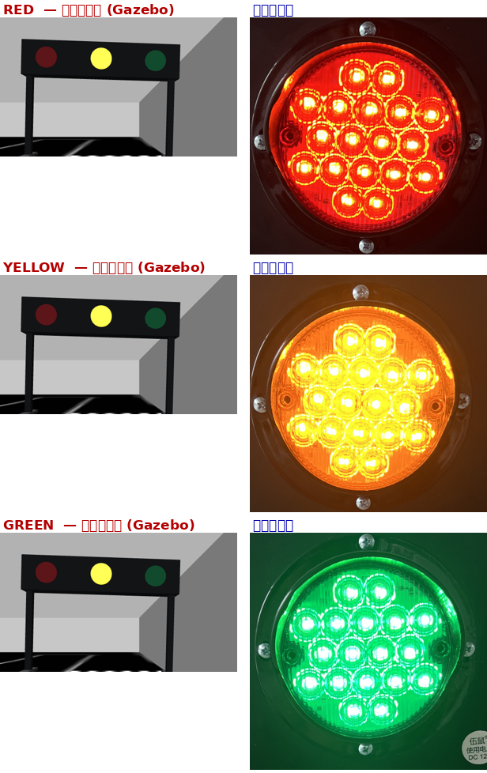

# 红绿灯模型 —— 按官方尺寸制作

> 资料来源：`~/复赛资料/红绿灯/`（官方复赛资料包）
> 制作日期：2026-09-21



## 一、官方尺寸（`尺寸图片.png`）

| 项 | 数值 | 来源 |
|---|---|---|
| 灯箱总宽 | **64 cm** | 图上标注 |
| 灯箱高 | **14 cm** | 图上标注 |
| 灯箱下沿离地 | **34 cm** | 图上标注 |
| 灯箱上沿离地 | **48 cm** | 图上标注 |
| 支架方柱边长 | **2.5 cm** | 图上标注 |
| 灯珠直径 | **8.5 cm** | 图上未标，按「64 cm 横线 = 1079 px」定标量得（143~149 px）|
| 灯珠中心间距 | **22 cm** | 同上（红-黄 373 px、黄-绿 372 px，等距）|

## 二、真实颜色（从官方 6 张状态参考图取样）

`红绿灯图片/` 下是 红/黄/绿 × 亮/暗 共 6 张实拍图。取透镜区中位色得到：

| 状态 | 暗（透镜本色，灭灯） | 亮（点亮） |
|---|---|---|
| 红 | `(0.467, 0.106, 0.122)` | `(0.969, 0.227, 0.086)` |
| 黄 | `(0.588, 0.357, 0.094)` | `(0.988, 0.976, 0.188)` |
| 绿 | `(0.094, 0.376, 0.227)` | `(0.086, 0.941, 0.529)` |
| 灯箱 | `(0.090, 0.102, 0.110)` | — |

> 亮灯时「最亮 8% 像素」已经过曝成近白，不能用来做材质，所以取的是**中位色**。

## 三、★ 一个关键认识：三个透镜始终可见

对比官方参考图可以确认：

- **亮灯**：高饱和 + 能看到内部 LED 点阵 + 有光晕
- **灭灯**：**同色但暗**、能看到透镜的棱纹纹理

也就是说，**真实红绿灯的三个透镜任何时候都看得见、各自有色，只是亮/暗不同**。

这直接推翻了我们旧模型的做法（旧模型把灭灯的灯珠**物理藏进灯箱内部**、三个透镜统一做成近黑色）。
用那种数据训 YOLO，模型会学到「彩色圆在竖排第几个位置」这种**伪特征**，
而真机上三个透镜都在、只有亮度差别 → 模型会失效。

**现在的做法**：

- 三个**暗色透镜常驻**在灯箱正面（各自真实颜色）
- 每个透镜后面挂一颗发光灯珠；亮时推到透镜前方 4 cm 露出来，灭时缩回灯箱内部
- 行程只有 4 cm，从画面看**几乎看不出灯珠伸缩**，视觉上就是「同一颗透镜亮/暗变化」

## 四、两种朝向

| 模型 | 灯箱（宽×高） | 灯珠排列 | 支架 |
|---|---|---|---|
| `traffic_light_h` | 64 × 14 cm | 沿 +y 排开，红-黄-绿 | 左右两根 |
| `traffic_light_v` | 14 × 64 cm | 沿 z 排开，红-黄-绿 | 正中一根 |

> **假设**：官方尺寸图只给了横排那盏。竖排按「同一套灯具旋转 90°」处理
> （灯箱 14 × 64、底座同样离地 34 cm）。示意图不是等比绘制，无法据此校验；
> 若官方另有竖排尺寸，改 `tools/setup_traffic_lights.py` 顶部常量即可。

**模型原点在地面、水平居中**，所以 world 里 `<pose>x y 0 yaw</pose>` 即可站稳
（旧模型原点在灯箱中心，`z` 曾给 0.55 —— 已改）。

## 五、⚠️ 相机高度与竖排灯的冲突

相机装在 `base_link` 上方 **0.20 m**、无俯仰，竖直半视场 ±22.6°：

| 灯 | 灯箱高度 | 能看到全部三颗灯的距离 |
|---|---|---|
| 横排 | 0.34 ~ 0.48 m | **1.0 m 起** ✓ |
| 竖排 | 0.34 ~ 0.98 m | **2.0 m 起**（1.5 m 时最上面那颗被画面顶部切掉）|

实测截图（车在出生点看左上那盏竖排灯）：红灯时最上面那颗**被切在画面外**。

**可选处理**（需要你定）：
1. 相机加一个 10°~15° **上仰**（改 `robot_params.yaml`，同时影响实车安装）
2. 把相机装高一点
3. 识别逻辑按「≥2 m 才开始判竖排灯」设计（横排灯不受影响）
4. 向组委会确认竖排灯的实际安装高度

## 六、怎么重新生成 / 调试

```bash
python3 tools/setup_traffic_lights.py --models-only   # 只重生成模型, 不动 world
python3 tools/setup_traffic_lights.py                 # 生成模型 + 插进 world
python3 tools/setup_traffic_lights.py --show          # 看当前配置
python3 tools/setup_traffic_lights.py --remove        # 从 world 移除
```

尺寸和颜色常量都在 `tools/setup_traffic_lights.py` 顶部，改完重跑即可。

摆位在 `src/competition_arena/config/traffic_lights.yaml`，坐标依据：
用本场地**已精确已知的斑马线**（`build_arena.py` 已提取）定位：

```
上斑马线  x [ 0.06,  0.27], y [ 1.50,  2.06]  -> 竖排灯放它左侧  (-0.15,  2.00) 朝 +x
中斑马线  x [-0.40,  0.17], y [-0.78, -0.57]  -> 横排灯放它下方  (-0.12, -2.00) 朝 +y
```

朝向按示意图里的**橙色箭头**（任务要求：「橙黄色箭头表示物料朝向」）。

贴墙放（|y| = 2.00，内墙 2.076）的原因：车道中心在 y≈±1.70，车体半宽 0.24 m，
车体边缘到 1.94 / −1.98；灯箱在 0.34 m 以上高度**高于车体**，只有 2.5 cm 细支架
在车高范围内，所以贴墙不会撞车——但把 64 cm 宽的横排灯横着摆进车道就会挡路。
