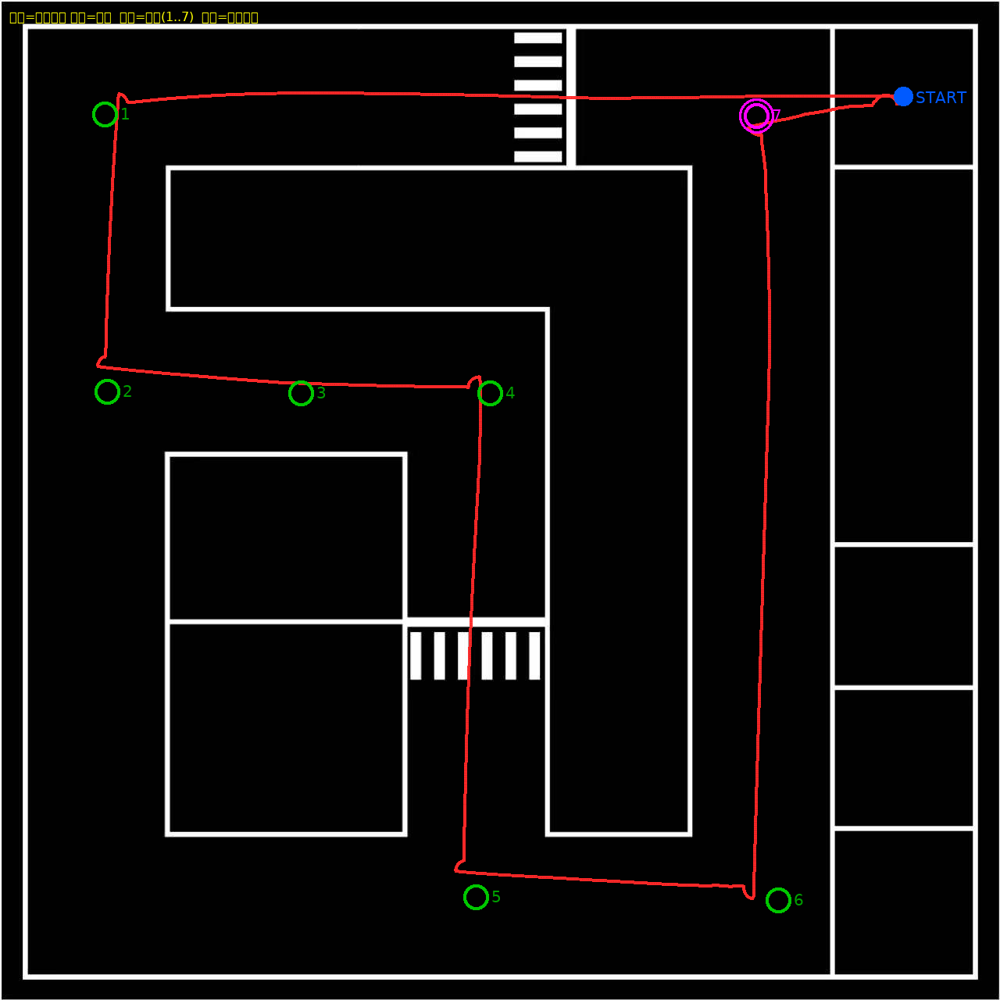

# competition_robot —— 四轮麦克纳姆比赛机器人

**sim2ros 的核心思路：参数只有一份，仿真和真机共用。**

```
                 config/robot_params.yaml          ← 唯一真值源
                          │
          ┌───────────────┴───────────────┐
          ▼                               ▼
  scripts/gen_robot.py             真机驱动节点
          │                        (读同一份 YAML)
          ▼                               │
  urdf/competition_robot.urdf             │
          │                               │
          ▼                               ▼
    Gazebo 仿真  ──── /cmd_vel ────→  真实小车
                 ←─── /odom ───────
```

仿真里调好的定位/导航参数搬到真车不用改，因为两边的
**几何、运动学、topic 名、frame 名**全部来自同一份参数。

---

## 1. 文件说明

```
competition_robot/
├── config/robot_params.yaml      ★ 唯一真值源（所有 [待测] 项填这里）
├── scripts/
│   ├── mecanum.py                麦克纳姆正/逆运动学  ← 仿真和真机共用
│   ├── mecanum_odometry.py       轮式里程计节点        ← 仿真和真机共用
│   ├── sim_wheel_encoders.py     编码器模拟            ← 仅仿真
│   └── gen_robot.py              YAML → URDF 生成器
├── meshes/                       实车导出的 STL (视觉用), 见下
├── urdf/competition_robot.urdf   生成物，别手改
├── launch/robot_gazebo.launch    场地 + 机器人 + 编码器 + 里程计 + RViz
├── rviz/robot.rviz
└── docs/参数测量清单.md          ★ 拿实车量尺寸的清单，先看这个
```

---

## 2. 改参数 → 重新生成

```bash
cd ~/桌面/人工智能算法大赛/src/competition_robot
# 编辑 config/robot_params.yaml
python3 scripts/gen_robot.py          # 重新生成 URDF，并打印摘要自检
cd ~/桌面/人工智能算法大赛 && catkin_make && source devel/setup.bash
roslaunch competition_robot robot_gazebo.launch
```

`gen_robot.py` 每次都跑自检：正/逆运动学互验、原地左转时左轮反转右轮正转。
自检 FAIL 就说明参数填错了（比如轴距/轮距填反）。

单独验证运动学：

```bash
python3 scripts/mecanum.py
```

---

## 3. 话题 / TF

| 话题 | 类型 | 频率 | 说明 |
|---|---|---|---|
| `/cmd_vel` | `geometry_msgs/Twist` | — | **全向**：`linear.x` 前后、`linear.y` 横移、`angular.z` 自转 |
| `/odom` | `nav_msgs/Odometry` | 50 Hz | 轮式里程计（编码器积分），仿真/真机同源 |
| `/odom_groundtruth` | `nav_msgs/Odometry` | 50 Hz | Gazebo 实测位姿，**仅仿真**，用来对比定位误差 |
| `/joint_states` | `sensor_msgs/JointState` | 50 Hz | 四个轮子转角（仿真里是编码器模拟） |
| `/scan` | `sensor_msgs/LaserScan` | 10 Hz | **★ 2D 雷达直接发的**（720 点/圈 = 0.5°，整圈，0.1~6 m），建图/定位用它 |
| `/points` | `sensor_msgs/PointCloud` | 10 Hz | 16 线 3D 雷达（**默认关**，见下面"为什么不用 3D 点云建图"） |
| `/camera/rgb/image_raw` | `sensor_msgs/Image` | 15 Hz | RGB 相机（**只发 RGB**） |
| `/camera/rgb/camera_info` | `sensor_msgs/CameraInfo` | 15 Hz | 相机内参 |
| `/imu` | `sensor_msgs/Imu` | 100 Hz | IMU |

> `/scan` 用的是 **2D 雷达（实车同款 镭神 N10_P）**，不是从 3D 点云切的。
> `robot_params.yaml` 里 `lidar2d.enabled: true` / `lidar3d.enabled: false`。

### ★ 为什么不用 3D 点云建图（2026-09-17 实测）

用 `gazebo_ros_block_laser` 驱动 16 线扫描时，**贴墙/在角落**这种位姿下会给出
几何上不可能的回波：车头明明 0.06 m 就贴墙，它却报 3.8~11.5 m 的点（还会"穿墙"）。
gmapping 把这些假点当成墙，就在地图**外面**糊出一大片扇形（已复现+量化）。
这个插件本来是给 2D 单线写的，所以 3D 就不指望它了。

改用 2D 雷达后同样的"死顶墙"测试：所有回波都和已知几何吻合到 2 cm 以内，
贴得比 `range_min` 还近的方向老老实实报 `inf`（无回波，SLAM 会跳过），
地图是一个干净的 4.2×4.2 正方。

要开 3D：`lidar3d.enabled: true` + `python3 scripts/gen_robot.py`，
然后再 `scan_from_cloud:=true` 就能用回"点云切一层"。真要长期用 3D，
建议换 velodyne 的 gazebo 插件（发标准 `PointCloud2`）。

**★ `/scan` 的车体自身回波过滤（不做的话 SLAM 一定歪）**：
3D 雷达装在车顶上方 0.20 m，它的下俯光束会打到自己车顶，在**车尾**形成一段
距离恒定（实测 0.207 m）、**跟着车走**的假回波扇形（车体局部 147°~213°，67 束）。
`range_min=0.2` 把更近的自回波剪掉之后，正好剩下这一段 —— SLAM 会把它当成一面墙，
结果是"车只走了一半、yaw 越跑越偏、地图整体歪掉"。

`pointcloud_to_scan.py` 的做法：把落在**车体碰撞盒**内部的点直接丢掉。
盒子由 `robot_params.yaml` 的 `chassis` 尺寸 + `sensors.lidar3d.mount` 算出来
（`self_filter_from_robot: true`），挪雷达/改车体会自动跟着变；
也可以用 `self_filter` 参数手写 `[xmin,xmax,ymin,ymax,zmin,zmax]`（雷达系）。

自检：起好仿真后跑

```bash
python3 tools/check_scan_selfhit.py     # 有车尾假回波就报错退出
```

另外节点会把"SLAM 实际看到的那层点"发到 `/points_filtered`（`PointCloud2`），
RViz 里默认显示它；原始 `/points` 也在，但默认关掉（`Lidar3D_raw`）。

TF：`odom → base_footprint → base_link → {fl,fr,rl,rr}_wheel_link / laser_link / camera_link / imu_link`

**里程计初值必须和出生位姿一致**：`mecanum_odometry.py` 从 `~initial_pose` 开始积分，
launch 会自动把 `x`/`y`/`yaw` 传进去。如果你手动 `rosrun`，记得自己传：

```bash
rosrun competition_robot mecanum_odometry.py _initial_pose:="[1.772, 1.782, 3.1416]"
```

不一致的话 `/odom` 会整体偏掉（起点差 180° 会让里程计镜像），建图会完全变形。

复位里程计（仿真重置模型后调，真机重新定位时也用）：

```bash
rosservice call /mecanum_odometry/reset
```

---

## 4. 设计取舍与已知限制

### 4.1 为什么用 `planar_move` 而不是真实轮子驱动

ODE（Gazebo 的物理引擎）对麦克纳姆轮辊子的摩擦建模很差：
辊子是 45° 的，而 ODE 每个碰撞体只能给一个固定的摩擦方向，
所以"用四个真实轮子摩擦出横移"基本做不出来 —— 车只会像差速车一样走。

所以运动用 `planar_move` 直接把 `(vx, vy, wz)` 施加到车体，
**保证 `cmd_vel` 的全向语义**。轮子仍然是真的、有碰撞、有各向异性摩擦
（滚动方向 `mu1`、轴向 `mu2` 都在 YAML 里可调）。

### 4.1.1 视觉用实车 STL

`meshes/` 里是从 `~/bit_ws/src/robot_description/mowen2/meshes/` 拷过来的**自己车的模型**
（7.2 MB），RViz / Gazebo 里显示的就是真车形状，不是简化几何体。

- 只用 mesh 做**视觉**，碰撞体一律用简化几何体（STL 做碰撞又慢又不稳）
- 轮子 STL 的包围盒是 `0.0968 × 0.0506 × 0.0970`，**Y 方向最薄** → 自转轴 = mesh 的 Y 轴，
  和关节轴一致，所以 **mesh 不需要额外旋转**
- 想换回简化几何体：`robot_params.yaml` 里 `simulation.visual_style: primitive`

### 4.2 编码器从哪来

**实测结论（有数据）**：车体速度是被驱动插件直接施加的，四个轮子大部分在**打滑**而不是滚动 ——
发 `vx=0.30` 跑 3 秒，车轮只转了 **1.56 rad**，而正常纯滚动应该是 `0.30×3/0.0485 = 18.6 rad`
（**只有 8%**）。所以 **Gazebo 的关节角度不能当编码器用**，
`libgazebo_ros_joint_state_publisher` 那套在这里没有意义。

复现：`bash tools/check_wheel_roll.sh`

所以编码器由 `sim_wheel_encoders.py` 模拟，它有两个速度来源（`~source` 参数）：

| `~source` | 含义 | 用途 |
|---|---|---|
| `groundtruth`（默认） | 用 `/odom_groundtruth` 里 planar_move **实测**的车体速度 | 编码器反映车实际怎么动的，`/odom` 和真值一致 |
| `cmd_vel` | 直接用指令速度 | 理想编码器，用来单独测里程计积分 |

真机上这个节点不存在，底层驱动读真实编码器发到同一个 `/joint_states`，
下游 `mecanum_odometry.py` 两边通用。

要模拟编码器量化和噪声，改 `~quantize` / `~noise_std` 参数。

### 4.2.1 相机只发 RGB

深度图默认**关掉**了（`sensor.publish_depth: false`）。原因有两个：
1. 用不上；
2. Gazebo 出的深度图是 `32FC1`，RViz 的 Image 显示看不了，看着就像"没返回内容"。

打开 `publish_depth: true` 就换回深度相机（`libgazebo_ros_openni_kinect.so`），
会多出 `/camera/depth/image_raw` 和 `/camera/depth/points`。

### 4.3 ✅ 自研全向驱动插件（原 planar_move 自转问题已解决）

**原来的问题**：`gazebo_ros_planar_move` 的实际自转只有指令的约 **0.72 倍**（线速度精确）。
发 `wz=0.5` 实际只转 `0.36`，写自转控制环会被坑。

**根因**（已定位并实证）：`planar_move` 内部调用 `Model::SetAngularVel()`，
而 Gazebo 这个函数会把模型**及其所有链接**的角速度都设成同一个值 ——
等于把四个车轮的角速度**锁死**，轮子不能自转，自转时只能横向刮地，
地面摩擦就把角速度吃掉了。

**验证方式**：自己写插件时把三种速度施加方式都实现了一遍，用同一个测试脚本实测对比：

| 施加方式 | vx | vy | **wz** |
|---|---|---|---|
| **canonical**（只设根 link） | 1.000 | 1.000 | **0.997** ✅ |
| all_rigid（正确的刚体速度分布） | 0.999 | 1.000 | 0.970 ✅ |
| model（= `SetLinearVel`/`SetAngularVel`，即 planar_move 的做法） | 1.000 | 1.000 | 0.723 ⚠ |
| `planar_move` 原生 | 1.000 | 1.000 | 0.722 ⚠ |

后两行几乎一样，直接证明了根因就是 `SetAngularVel` 的"设置所有链接"行为。

**解法**：`src/holonomic_drive_plugin.cpp` —— 只设**根 link** 的速度，
让车轮通过关节自由滚动。现在默认就用它。

```xml
<plugin name="holonomic_drive" filename="libcompetition_holonomic_drive.so">
  <commandTopic>cmd_vel</commandTopic>
  <odometryTopic>odom_groundtruth</odometryTopic>
  <velocityMode>canonical</velocityMode>   <!-- canonical / all_rigid / model -->
  <cmdTimeout>0.5</cmdTimeout>
</plugin>
```

插件的 `twist` 是用**位姿差分**算出来的实测值（不是指令值），
所以可以直接拿 `/odom_groundtruth` 校验驱动保真度。

想回到原版对比：把 `config/robot_params.yaml` 里 `simulation.drive_plugin` 改成 `planar_move`。

---

## 4.4 跑建图算法

仿真已经把 SLAM 需要的都准备好了，实测确认：

| SLAM 需要 | 仿真提供 |
|---|---|
| 2D 激光 | `/scan`，frame `laser_link`，±180°/1°，0.2~30 m ✅ |
| 里程计 | `/odom` + TF `odom → base_footprint` ✅ |
| 雷达外参 | TF `base_footprint → laser_link` = (0.134, 0, 0.200) ✅ |

本机 `/opt/ros` 里**一个 SLAM 包都没装**，先装（网络和 apt 都正常，我验证过了）：

```bash
sudo apt install ros-noetic-gmapping ros-noetic-slam-karto ros-noetic-open-karto \
                 ros-noetic-map-server ros-noetic-amcl ros-noetic-move-base \
                 ros-noetic-teleop-twist-keyboard
```

然后：

```bash
# GMapping（最常用的 2D 激光 SLAM）
roslaunch competition_robot slam_gmapping.launch

# Karto（图优化，回环比 gmapping 好）
roslaunch competition_robot slam_karto.launch
```

两个 launch 都会**自动带上仿真**，另开一个终端用键盘开：

```bash
rosrun teleop_twist_keyboard teleop_twist_keyboard.py
```

存地图：

```bash
rosrun map_server map_saver -f ~/桌面/人工智能算法大赛/maps/my_map
```

> 出生点默认在场地的西南角 (-1.5, -1.5)、朝场地中心，不在正中间，
> 方便建图。想改：`roslaunch ... x:=-1.0 y:=1.0 yaw:=0`
>
> **注意**：现在场地只有外沿围墙（按你之前的要求），内部是空的。
> 想建一张有内容的图，用 `python3 scripts/build_arena.py --walls all` 重新生成场地。

## 4.5 定位 + 导航（AMCL + move_base）

```bash
roslaunch competition_robot navigation.launch              # 仿真 + 地图 + AMCL + move_base + RViz
roslaunch competition_robot navigation.launch gui:=false   # 不开 Gazebo 界面, 省显卡
roslaunch competition_robot navigation.launch sim:=false   # 仿真已经在跑的时候用
```

RViz 里操作：先用 **2D Pose Estimate** 点一下车的位置（或者直接信 launch 给的初始位姿，
默认就是出生点），再用 **2D Nav Goal** 点目标点，车自己开过去。
不想开 RViz 也能发目标：

```bash
python3 tools/go_to.py 0 0               # 去场地中心
python3 tools/go_to.py -1.5 -1.5 1.57    # 去某个角, 朝 +y (yaw 用弧度)
```

参数在 `config/nav/`：

| 文件 | 管什么 |
|---|---|
| `amcl_params.yaml` | 定位：**omni 模型**（麦轮）、粒子数、噪声、雷达量程 0.1~6 m |
| `costmap_common_params.yaml` | 车体轮廓 `[[-0.17,-0.19]...[0.21,0.19]]`、障碍层（吃 `/scan`）、膨胀层 0.35 m |
| `global_costmap_params.yaml` | 全局代价地图：`map` 系，用静态地图 + 障碍 + 膨胀 |
| `local_costmap_params.yaml` | 局部代价地图：`odom` 系，滚动窗口 4.5 m |
| `base_local_planner_params.yaml` | 局部规划 `TrajectoryPlannerROS`，**`holonomic_robot: true`**（麦轮可横移） |
| `move_base_params.yaml` | 全局规划 `navfn/NavfnROS`、频率、恢复行为 |

**实测（无窗口跑，目标点 vs Gazebo 真值）**：

| 项目 | 结果 |
|---|---|
| 场地内 6 个目标点连续导航 | **6/6 全部到达，0 次恢复行为** |
| AMCL 定位误差 vs 真值 | 中位 **5.1 cm**，90 分位 9.3 cm，最大 15 cm |
| 到点精度（map 系） | 都在 `xy_goal_tolerance` 0.15 m 以内 |
| 速度 | 直线段跑到 `max_vel_x` **0.354 m/s**（上限 0.35） |
| 从角落出生点出发的第一个目标 | 较慢（~24 s），要先从高代价区挪出来再转 180° |

### 4.5.2 墙角到不了 / 卡住 —— 已修（`track_unknown_space` 的坑）

现象：目标点在墙角附近时，车明明已经开到**离目标只剩 5 cm**，动作却一直不结束，
日志里反复出现：

```
[WARN] Rotate recovery behavior started.
[ERROR] Rotate recovery can't rotate in place because there is a potential collision. Cost: -1.00
[ERROR] Aborting because a valid control could not be found. Even after executing all recovery behaviors
```

**`Cost: -1` 是"未知格"**。局部代价地图原来 `track_unknown_space: true`，于是
**车自己脚下那一片**（激光被自己挡住、贴墙时前方光束又全是"小于最近量程"的 inf，
清不掉）会一直留在"未知"。而 `base_local_planner` 把 `NO_INFORMATION` 当作碰撞，
所以**所有候选轨迹都无效** → 恢复行为也拒绝旋转 → abort。

修法：**局部代价地图 `track_unknown_space: false`**（未知 = 可走）；
同时把膨胀从 `0.25 / 4.0` 收到 `0.18 / 3.0`、`footprint_padding` 收到 0.01，
并给全局规划器加 `default_tolerance: 0.30`（目标落进膨胀区时自动投射到最近可达点）。

实测（同一组越来越贴墙的墙角目标，起点场地中心）：

| 目标（离墙内沿） | 修之前 | 修之后 |
|---|---|---|
| (0.5, 0.5)（1.6 m） | ✓ | ✓ |
| (1.5, 1.5)（0.6 m） | ✓ | ✓ |
| **(1.7, 1.7)（0.4 m）** | ✗ 卡在 5 cm 外永远到不了 | **✓ 到达** |
| (1.82, 1.82)（0.25 m） | ✗ | ✗（**车体物理上放不下**，现在会干净 abort） |

`Cost=-1` 出现次数 6 → 2，恢复行为 12 → 4。

### 4.5.3 导航用"几何生成的干净地图"（默认）

SLAM 建的图有两个先天问题：占用栅格把墙糊厚、坐标系和世界系差几厘米。
场地是**已知几何**，所以直接用几何生成更准：

```bash
python3 tools/gen_map_from_arena.py            # -> maps/arena_clean.pgm/.yaml (+自动拷进包里)
python3 tools/gen_map_from_arena.py --obstacles obstacles.yaml   # 以后场地里加障碍物
```

| | SLAM 图 `maps/arena.yaml` | **干净图 `maps/arena_clean.yaml`** |
|---|---|---|
| 分辨率 | 0.05 m | **0.025 m** |
| 墙的内边界 | ±2.015（侵入自由区 6 cm） | **±2.075（真值 2.076，差 1 mm）** |
| 可走面积 | 16.81 m² | **17.22 m²** |
| 坐标系 | 和世界系差几厘米 | **就是世界系**（AMCL 初始位姿不用猜） |
| 直线 3 m 横向偏差 | 2.6 cm | **1.6~2.4 cm** |

`navigation.launch` 默认已经换成它；想换回 SLAM 图：
`map:=$(find competition_robot)/maps/arena.yaml`。

**为什么墙角会"卡住"（根因，2026-09-18 修）**：
`costmap_2d` 的**膨胀层**会沿障碍画一圈 `inscribed_radius`（由足迹顶点算出 = 0.179 m）
的"内切禁区"（cost=253），而 DWA 把 253 当碰撞 →
**车心被挡在离墙 0.18 + 车体前凸 0.20 ≈ 0.38 m 处**，明明物理上还能再走 0.15 m；
目标点落进这条带里就会反复恢复行为/卡住。

修法：**局部代价地图去掉膨胀层**（只留障碍层）。这样局部地图里墙只剩"致命格"，
碰撞由 DWA 的**多边形足迹**判断 → 能贴到物理极限；全局地图保留膨胀，
所以规划出的路径照样不贴墙。
实测：墙角目标不再触发恢复行为（0 次），动作会在最近可达点正常结束而不是卡住。

> 副作用：局部地图没有膨胀梯度了，`occdist_scale` 基本失效（靠全局路径避墙）。
> 注意 `gazebo_ros_laser` 的 `/scan` 在贴墙时前方是 `inf`，局部地图靠
> `track_unknown_space: false` 才不会被"未知格"卡死（见 4.5.2）。

**墙角能开到多近**（实测，DWA + 干净图）：
`(1.5,1.5) ✓  (1.75,1.75) ✓  (1.82,1.82) ✗`。
限制来自代价地图本身：墙边 0.18 m 是"内切禁区"（inscribed_radius，由足迹顶点算），
**再加上车体前凸 0.20 m**，圆心要离墙 ~0.38 m 才进得去。
想更贴墙可以把 `costmap_common_params.yaml` 的足迹再缩小，或在两个 costmap 的
namespace 里手动指定 `inscribed_radius`（代价是碰撞裕度变小）。
**结论：目标点放在 `|x|,|y| ≤ 1.75` 以内**，`tools/go_to.py` 会自动检查并提示。

**末端"偏出直线"是怎么回事**：不是 bug，是"必须转朝向"的代价。
实测（干净图，起点 (1.5,0) → 目标 (-1.5,0)）：

| 目标朝向 | 横向偏差(末端1m) | 到点前原地转 |
|---|---|---|
| 和行进方向一致 | **2.4 cm** | 0 s |
| 转 90° | 8.7 cm（一段弧线） | 1.0 s |
| 转 90° + `latch_xy_goal_tolerance: true` | ~2 cm（走直线） | 转完再停 |
| 转 90° + `yaw_goal_tolerance: 1.0~3.15`（不在意朝向） | ~6 cm | 0 s |

也就是说：**要么边走边转（弧线），要么到点再转（原地）**，
`latch_xy_goal_tolerance` 就是这个开关。想两者都要，得换成能"把转弯规划进轨迹"的
规划器（TEB，但在这张小场地里会摆头，见 4.5.1）。

> **地图里的墙有多厚**（实测 `maps/arena.pgm`）：真实墙体 24 mm，
> 但 karto 的占用栅格糊成了 **2 格 = 100 mm**，自由区因此向内缩了约 60 mm。
> 所以**目标点离墙内沿至少留 0.30 m**（map 系里 `|x|,|y| ≲ 1.75`）。
> `tools/go_to.py` 现在发目标前会用地图片查一次"这里放得下车吗"，
> 放不下会自动挪到最近的合法点并打印出来，不会再默默卡死。

**两个坑（都踩过）**：

1. **目标点别贴着墙**。场地只有 4.2 m，`inflation_radius` 给大了（0.35）时，
   离墙 0.6 m 以内的目标会落进高代价区 → move_base 走到跟前就
   "Rotate recovery behavior started" 原地转圈，永远不宣布到达。现在用 **0.25**，
   目标点离墙留 **0.4 m 以上**。
2. **目标失败时别立刻 cancel**。move_base 正在做恢复行为时把 goal 取消，
   它会卡在"一边转圈一边忽略新目标"的状态，后面所有目标都不动。
   遇到到不了的点，先取消、等它停下来，或者干脆别取消让它自己 abort。

地图默认用 `maps/arena.yaml`（包里那份，就是自己建的那张）。
换地图：`map:=/绝对路径/xxx.yaml`，或者把 `xxx.pgm/.yaml` 拷进 `src/competition_robot/maps/`。

### 4.5.1 换局部规划器（走直、转弯丝滑）

本机原来只有 `base_local_planner/TrajectoryPlannerROS`（最老的一代），实测两个毛病：

| 现象 | 原因 |
|---|---|
| 走不直、蛇形 | `holonomic_robot: true` 时它的打分函数在横移方向太平；前瞻 `sim_time` 又太短 |
| 快到点才调方向、然后原地转圈 | `latch_xy_goal_tolerance: true`：一进位置容差就停止平移，只原地转到目标朝向 |

**这两条我已经在 `base_local_planner_params.yaml` 里改掉了**（改成差速模式 + 关 latch +
放宽容差 + 前瞻 3 s）。实测同一条"斜线 3 m + 末端对朝向"：

```
改之前:  57.3 s   到点前原地转 6.8 s   蛇形 4 次   恢复行为 1 次
改之后:  19.0 s   到点前原地转 0.8 s   蛇形 2 次   恢复行为 0 次
直线 3 m: 横向偏差 3 mm, 全程 0 次原地转
```

**三个规划器的实测对比**（同一套测法，`bash tools/bench_nav.sh`）：

| 规划器 | 直线 3 m 横向偏差 | 直线到点 | 斜线 + 贴墙目标 (-1.5,-1.5) | 中场转弯目标 (0,-1.0) |
|---|---|---|---|---|
| `dwa`（**默认**） | **2.4 cm** | ✓ 13.0 s | ✓ **13.9 s**（偏差 0.11 m，0 恢复） | — |
| `teb` | 3.7 cm | ✓ 12.6 s | ✓ 40.9 s（绕 0.44 m，1 恢复） | ✓ 丝滑、无原地转 |
| `traj`（保底） | 3 mm | ✓ 10.9 s | ✓ 19.0 s（原地转 0.8 s） | — |

结论：**默认用 DWA**（哪儿都能到、走直线最直、现在也装上了）；
**目标离墙 ≥0.6 m 时 TEB 更快更丝滑**（无原地转向，9.2 s）；
**贴着墙的目标别用 TEB**（它会在端头来回摆头）。

> TEB 踩过的两个坑（都写进配置注释了）：`max_vel_y > 0` 时它会用"斜着滑过去"
> 抄近路（直线偏 76 mm、69% 时间在横移，看着很怪）；`weight_kinematics_nh` 给太大
> （500）又会为了满足约束来回摆头（直线弯 110 mm）。现在 `max_vel_y: 0` + 小权重。

**想用 TEB**（把整条轨迹当优化问题解，输出连续曲率）：

已经装好了（`ros-noetic-teb-local-planner` / `dwa-local-planner` / `global-planner`），直接切：

```bash
roslaunch competition_robot navigation.launch planner:=teb     # TEB（中场目标丝滑）
roslaunch competition_robot navigation.launch planner:=dwa     # DWA（默认，最稳）
roslaunch competition_robot navigation.launch planner:=traj    # 保底那个
roslaunch competition_robot navigation.launch gplan:=global    # 换全局规划器
```

> 小技巧：如果不需要精确的最终朝向，把 DWA 的 `yaw_goal_tolerance` 从 0.15 放到 0.5，
> 端头就不会再"原地转一下对方向"了。

三个局部规划器的参数都在 `config/nav/` 里，各自独立命名空间，随时切换、随时 A/B。

**量化对比工具**（同一条直线/斜线，自动出"直不直、丝不丝滑"的指标）：

```bash
bash tools/bench_nav.sh traj                       # 基准
bash tools/bench_nav.sh teb                        # 装完 TEB 再跑
bash tools/bench_nav.sh teb -1.5 -1.5 0            # 带转弯的场景
python3 tools/analyze_nav_run.py .verify/bench_nav_teb.pkl   # 单看指标
```

指标含义：横向偏差（越小越直）、蛇形指数（方向翻转次数）、角速度变化率 RMS（越小越丝滑）、
到点前原地转时长（就是"原地转圈找方向"）。

**TEB 想更直/更丝滑主要调这几个**（都在 `teb_local_planner_params.yaml`）：
`weight_viapoint` ↑ 更贴全局路径（更直）、`weight_optimaltime` ↑ 更快、
`max_vel_y` 设 0 就不横移（像差速车）、`weight_kinematics_nh` 设大（如 100）会强制"朝前开"、
`enable_homotopy_class_planning: true` 能让它自己选从左边绕还是右边绕（更费 CPU）。

> **sim2ros**：这套 amcl/move_base 参数真机直接能用——帧名（`map`/`odom`/`base_footprint`/`laser_link`）、
> 话题名（`/scan` `/odom` `/cmd_vel`）都和实车一致。唯一区别是 `/odom` 的来源：
> 仿真里是"理想编码器 + 麦轮运动学"，真机上是编码器 + `robot_localization` EKF。

## 4.6 航点巡航（图上标点 → 自动跑一圈）

流程（四步，标准作业）：

```bash
# ① 拿一张带网格的图, 在上面标点 (或用任意画图工具画红点)
#    src/competition_arena/docs/coord_world_grid.png   每 0.5 m 一条线并标了世界坐标
#    绿框 |x|,|y|<=1.75 之内车才停得进去
# ② 标好把图发我/放进来, 自动识别红点 -> 生成航点文件
python3 tools/detect_marks.py 标注图.jpeg --out src/competition_robot/config/waypoints.yaml
# ③ 校对 (会提示哪些点太靠墙)
python3 tools/patrol.py --dry-run
# ④ 开始巡航 (先 cmd_vel 原地转向, 再让 DWA 直着过去; 最后回起点)
roslaunch competition_robot navigation.launch        # 另开终端也行
python3 tools/patrol.py --save-trace /tmp/trace.csv  # 轨迹存成 csv
python3 tools/plot_trace.py --trace /tmp/trace.csv \
        --waypoints src/competition_robot/config/waypoints.yaml --out trace.png
```

航点文件（world 和 pixel 二选一，pixel 就是网格图的像素）：

```yaml
start: [1.772, 1.782]
waypoints:
  - {name: corner, pixel: [1138, 145]}                  # 也可写 world: [1.709, 1.709]
  - {name: ring,   world: [1.128, 1.698], yaw: 0.0}     # 可选: 到点后原地转到这个朝向
```

**两个约定**（按实测体验定的）：

1. **第一个点不用单独标**：出生点本身就是第一站。所以航点文件里第一个 `waypoints`
   应该直接是你想去的**第一个真目标**（我们原来那个"出生小方块拐角"离出生点只有 9 cm，
   会让车在原地转两次身，已去掉）。
2. **回起点后会把车头摆回出发时的朝向**：`patrol.py` 开跑前记录当时的 yaw，
   最后回到 `start` 后用 `cmd_vel` 原地转回那个角度（实测残余 <1.5°）。
   想固定成某个角度就在 yaml 里写 `start_yaw: 3.1416`。

**为什么"先转再走"**：DWA 在"边转边走"时末端会画一段弧线（实测 90° 转向横向偏 8~9 cm）；
先把车头摆正再直线过去，实测 3 m 直线横向偏差 **2.4 cm**，到点误差就是容差本身。

**实测**（8 个航点 + 回起点，干净地图 + DWA + `xy_goal_tolerance: 0.07`）：

```
7/7 航点 + 回起点全部到达, 一圈 ~2 分钟 (仿真时间)
到点误差 AMCL 6~7 cm; 回起点后转回出发朝向, 残余 <1.5 度
```



> 注意：图里那些白线只是**地面贴图花纹**，仿真里没有实体墙（按你定的"内部空场"），
> 所以车会直接从线上开过去。哪天真要内部墙：`python3 scripts/build_arena.py --walls all`。

## 5. 验证结果（本机实测，实车真值参数 + 自研驱动插件）

| 项目 | 结果 |
|---|---|
| 话题 | `/cmd_vel` `/odom` `/odom_groundtruth` `/joint_states` `/imu` `/points` `/scan` `/camera/*` 全部 ✅ |
| 前进 / 后退 / 左横移 / 右横移 / 斜行 | ✅ 全部正确 |
| **线速度保真度** | **1.000** ✅ |
| **角速度保真度** | **0.994** ✅（原来是 0.72，见 4.3） |
| 里程计 前进 / 横移 / 边走边转 | 位置差 **0.2% ~ 0.3%** ✅ |
| 里程计 自转 | 位置差 1.2%，角度差 0.003 rad ✅ |
| 传感器 | 2D 雷达 10 Hz、IMU 100 Hz、深度相机 15 Hz、`/joint_states` 50 Hz ✅ |
| 编译 | `catkin_make` 通过（含 C++ 插件），无报错 |

复现：

```bash
cd ~/桌面/人工智能算法大赛
source devel/setup.bash
bash tools/test_robot.sh            # 无头端到端自检
bash tools/test_drive_modes.sh      # 四种驱动方式保真度对比
```

## 6. 当前占位值 vs 真值

`config/robot_params.yaml` 里所有标 `[待测]` 的都是我猜的典型值：

| 参数 | 当前占位 | 你的实车 |
|---|---|---|
| 车体 长×宽×高 | 0.360 × 0.280 × 0.140 m | ? |
| 整车质量 | **3.15 kg**（按部件估，见下） | 上秤称 |
| 离地间隙 | 0.050 m | ? |
| 轮径 / 轮宽 | 0.060 / 0.045 m | ? |
| 轴距 / 轮距 | 0.300 / 0.320 m | ? |
| 单个轮子质量 | 0.40 kg | ? |
| 编码器 线数×减速比×倍频 | 1024 × 30 × 4 | ? |
| 3D 雷达 | 16 线，±15°，360 点/线 | ? |
| 深度相机 | 640×480，87° HFOV | ? |

按 [`docs/参数测量清单.md`](docs/参数测量清单.md) 量完填进去就行。

### 整车质量估算（没有秤，按部件估）

`gen_robot.py` 每次都会打印质量账目。当前估算合计 **3.15 kg**：

| 项目 | 质量 | 依据 |
|---|---|---|
| 车体结构 | 0.486 kg | CAD 导出（纯结构件） |
| 4× 电机+减速箱 | 0.480 kg | 0.12 kg/个（估） |
| 电池 | 0.300 kg | 3S LiPo（估） |
| 工控机 | 0.200 kg | 树莓派/Jetson 级（估） |
| 电机驱动板 | 0.120 kg | （估） |
| 支架/螺丝/线材 | 0.264 kg | （估） |
| **4× 麦轮** | **0.206 kg** | CAD 0.0515 kg/个 |
| **3D 雷达** | **0.900 kg** | 16 线整机（估，**单项最重**） |
| 深度相机 | 0.170 kg | Astra Pro 官方 165 g |
| IMU | 0.020 kg | （估） |
| **合计** | **3.15 kg** | |

有秤之后称一下整车，改 `chassis.mass` 让它对上就行
（各部件质量都在 YAML 里，改完 `gen_robot.py` 会重新算总重）。
